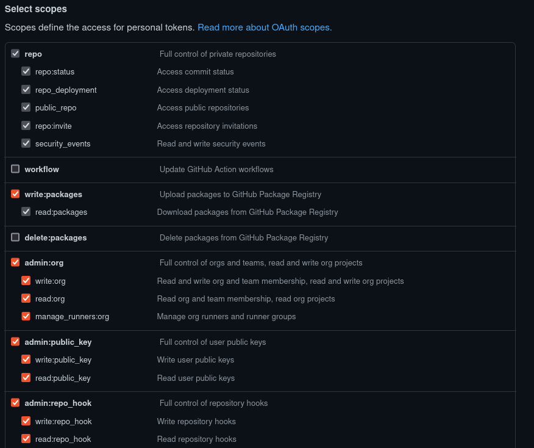

# Automate creation of the certification projects

This role automatically creates a container certification project if option `create_container_project: true` is provided, and operator certification project if `create_operator_project: true`.

Note: For the latest information on how the container product listing attachment works, please click [here](https://github.com/redhat-cip/dci-openshift-app-agent/blob/master/roles/openshift_cnf/README.md#automate-creation-of-the-openshift-cnf-project-for-vendor-validated)


## Global Variables

Name                     | Default                                                                    | Description
-------------------      | ------------                                                               | -------------
connect_url              | https://connect.redhat.com/projects                                        | Mandatory; usually there is no need in redefining it. Certification UI link, you may need to change it to target UAT environment for the testing.
catalog_url              | https://catalog.redhat.com/api/containers/v1                               | Mandatory; usually there is no need in redefining it. Pyxis API to create certification project, you may need to change it to target UAT environment for the testing.
github_token_path        | undefined                                                                  | Mandatory when using `create_operator_project`. Path to GitHub token to be used for the operator certification project.
organization_id          | None                                                                       | Mandatory when using `create_container_project`. Company ID to be used for the verification of container certification project.
page_size                | 200                                                                        | Define a page size for Pyxis API queries. Number of results to retrieve in a single page.
check_for_existing_projects | false                                                                   | Optional. Set this option to `true` if you want to use a custom error handling for cases where the cert project already exists within the same organization or in a different organization. Please define organization_id when using this option.


## Variables to define for each operator / container

Name                     | Default                                                                    | Description
-------------------      | ------------                                                               | -------------
create_container_project | false                                                                      | If set to true, it would create a new container certification project.
create_operator_project  | false                                                                      | If set to true, it would create a new operator certification project.

## Variables to define for project settings under `cert_settings` main variable (Optional)

Below an example of variables used for container and operator image certification project, more variables are available depending is created for operator or helmchart certifications. All sub-variables are optional.

For more details see full [API schema](https://catalog.redhat.com/api/containers/v1/ui/#/Certification%20projects/pyxis.rest.legacy.cert_projects.patch_certification_project)

### Container `cert_settings`

Name                       | Default                              | Description
-------------------        | ------------------------------------ | -------------
auto_publish               | false                                | false or true: boolean to enable auto publish
build_categories           | "Standalone image"                   | Image type, choose between "Standalone image", "Operator image" or "Component image".
registry_override_instruct | "Add override instructions"          | (String) Additional instructions to get image.
email_address              | None                                 | Maintainer email addresses separated by a comma.
application_categories     | "Networking"                         | (String) Up to three categories related to the function of the image/operator. Examples: "Networking", "Storage", "Security".
os_content_type            | "Red Hat Universal Base Image (UBI)" | Base OS running in the image. Either "Red Hat Enterprise Linux" for RHEL or "Red Hat Universal Base Image (UBI)" for UBI.
privileged                 | true                                 | false or true: false when the container is isolated from the host, and true when the container requires special Host level privileges.
release_category           | "Generally Available"                | Whether the resource to certify is either GA or Beta, choose between: "Generally Available" or "Beta".
repository_description     | "Add a description of project here"  | This will be displayed on the container catalog repository overview page.

### Operator `cert_settings`
Name                       | Default                              | Description
-------------------        | ------------------------------------ | -------------
auto_publish               | false                                | false or true: boolean to enable auto publish
registry_override_instruct | "Add override instructions"          | (String) Additional instructions to get image.
email_address              | None                                 | Maintainer email addresses separated by a comma.
application_categories     | "Networking"                         | (String) Up to three categories related to the function of the image/operator. Examples: "Networking", "Storage", "Security".
privileged                 | false                                | false or true: false when the container is isolated from the host, and true when the container requires special Host level privileges.
repository_description     | "Add a description of project here"  | This will be displayed on the container catalog repository overview page.

## Variables to define for project settings under `cert_listings` main variable (Optional)

Name                          | Default                              | Description
----------------------------- | ------------------------------------ | -------------
pyxis_product_lists           | None                                 | A list of Product Listings; all of them must be created beforehand [See doc](https://redhat-connect.gitbook.io/red-hat-partner-connect-general-guide/managing-your-account/product-listing). It could contain one or many PLs. If set, it will attach all PLs to both old and new certification projects.
published                     | false                                | Boolean to enable publishing list of products
type                          | "container stack"                    | String. Type of product list


## Example of configuration file

```yaml
$ cat /etc/dci-openshift-app-agent/settings.yml
---
# job name and tags to be displayed in DCI UI
dci_name: "Testpmd-Operator-Preflight"
dci_tags: ["debug", "testpmd-operator", "testpmd-container"]
dci_topic: "OCP-4.7"
# DCI component for every OCP version
# could be checked here: https://www.distributed-ci.io/topics
dci_component: ['8cef32d9-bb90-465f-9b42-8b058878780a']

# Optional, please provide these credentials
# if your registry is private.
partner_creds: "/opt/pull-secrets/partner_config.json"

# Optional; provide it when you need to submit test results.
# This token is shared between all your projects.
# To generate it: connect.redhat.com -> Product certification ->
# Container API Keys -> Generate new key
pyxis_apikey_path: "/opt/cache/pyxis-apikey.txt"

# Required to create and update cert projects.
# Check the instructions below on where to retrieve it
organization_id: "12345678"

# Optional; provide this token when using create_pr option
# while creating operator or helm-chart project
# Check the instructions below on how to create it
github_token_path: "/opt/cache/dcicertbot-token.txt"

# List of operators to certify,
# you could provide many operators at once.
preflight_operators_to_certify:
  - bundle_image: "quay.io/rh-nfv-int/bla-bla-bundle:v0.2.1"
    # Mandatory for the connected environments.
    index_image: "quay.io/rh-nfv-int/bla-bla-catalog:v0.2.1"
    # Optional; provide it when you need to create
    # a new "Container Image project" and submit test results in it.
    create_container_project: true
    # Optional; provide it when you need to create
    # a new "Operator Bundle Image" and submit test results in it.
    create_operator_project: true
    # Required when creating cert project
    short_description: "Add 50+ characters image description here"
    # Optional; use it to automatically open cert PR
    # at the certified-operators repository
    create_pr: true

# List of container images to certify,
# you could provide multiple images to certify at once.
preflight_containers_to_certify:
  - container_image: "quay.io/my-container/bla-bla-image:v0.0.1"
    create_container_project: true
    # Required when creating cert project
    short_description: "Add 50+ characters image description here"

# Project certification setting (Optional)
# This allows to fill the rest of the project settings after project creation
# Any project for containers images certifications can use them
# TODO: provide cert_settings example for every project type
cert_settings:
  auto_publish: false
  build_categories: "Standalone image"
  registry_override_instruct: "These are instructions of how to override settings"
  email_address: "email@example.com"
  application_categories: "Networking"
  os_content_type: "Red Hat Universal Base Image (UBI)"
  privileged: false
  release_category: "Generally Available"
  repository_description: "This is a test repository"

# Project certification list setting (Optional)
cert_listings:
  published: false
  type: "container stack"
  pyxis_product_lists:
    - "yyy"
    - "xxx"
```

## GitHub token

Please note that `github_token_path` is required when using `create_operator_project` project. It is used to setup proper permissions in the certification project.

Here are the required token permissions.




## Organization ID

Variable `organization_id` is required when using `create_container_project` project. It is used to validate the existing certification projects in the organization with the same image and registry

For more information of how to retrieve the organization ID see the [Connect Portal API documentation](https://redhat-connect.gitbook.io/partner-guide-for-red-hat-openshift-and-container/appendix/connect-portal-api/project-creation#company-id)
