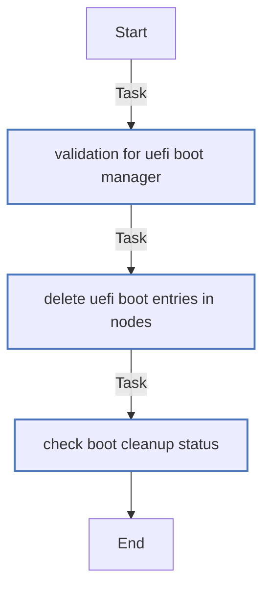

<!-- DOCSIBLE START -->
# efi_boot_mgr

Remove the non-active UEFI boot entries from OCP nodes.

## Requirements

Role Requirements go here

## Inputs

| Var  | Type  | Required | Default  | Description
| ---- | ----- | -------- | -------- | -----------
| ebm_nodes | list | True | \<undefined\> | A list of OCP node names to manage their Boot order.
| ebm_oc_path | str | False | /usr/local/bin/oc | Path to oc client.

## Variables 
| Var          | Type         | Value       | Required    | Title       |
|--------------|--------------|-------------|-------------|-------------|
| [ebm_oc_path](defaults/main.yml#L6)   | str   | `/usr/local/bin/oc`  |  false  |  Path to oc binary | 

🖇️ Full descriptions for vars in defaults/main.yml

 
<b>ebm_oc_path:</b> Allow to override the path of oc binary 
 
 

   

## Task Flow Graphs

### Graph for main.yml

## License

Apache-2.0

<!-- DOCSIBLE END -->