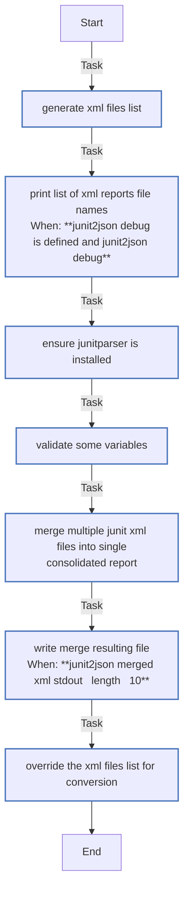
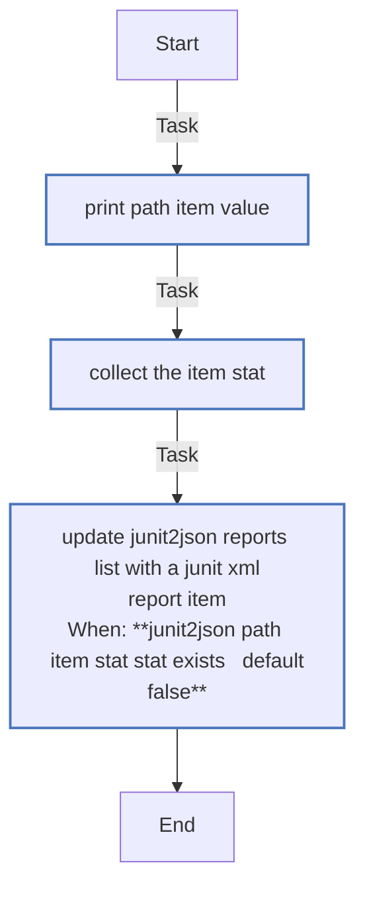
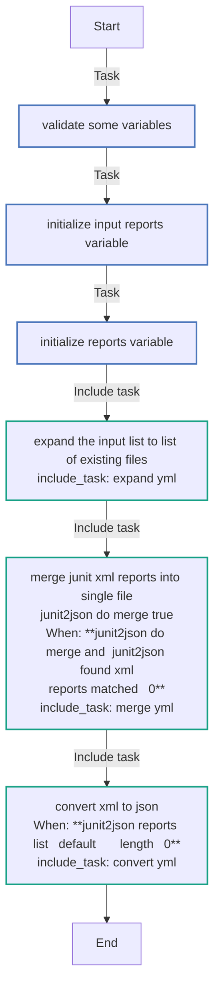
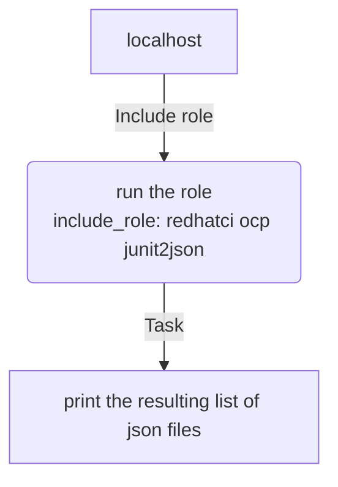

<!-- DOCSIBLE START -->

# 📃 Role overview

## junit2json


Description: Converts XML junit reports passed or in passed directory into single or fragmented JSON report file(s)


<details>
<summary><b>🧩 Argument Specifications in meta/argument_specs</b></summary>

#### Key: main 
**Description**: The resulting JSON file(s) are of the same structure for all the teams' and CI systems and used later to be sent to the data collection system.
This is the main entrypoint for the role `redhatci.ocp.junit2json`.
Converts XMLs into JSON, if variable `junit2json_do_merge` is `true`, multiple XMLs are merged into one XML file.
New filename(s) is(are) based on the old ones and stored in global variable `global_json_reports_list`.


  - **junit2json_input_reports_list**
    - **Required**: True
    - **Type**: list
    - **Default**: none
    - **Description**: List of JUnit XML report files to convert to JSON

  
  
  

  - **junit2json_do_merge**
    - **Required**: False
    - **Type**: bool
    - **Default**: True
    - **Description**: Should we merge data of converted reports into 1 file or not.
When `false`, each report `XML` file is converted to a corresponding json file appended `.json` extension
Otherwise, resulting merged report is named as the directory, with `.report.json` extension.
in both cases, the result is stored under `junit2json_output_dir`.

  
  
  

  - **junit2json_output_dir**
    - **Required**: True
    - **Type**: str
    - **Default**: none
    - **Description**: Output directory for resulting report JSON file path(s)

  
  
  

  - **junit2json_input_merged_report**
    - **Required**: False
    - **Type**: str
    - **Default**: ''
    - **Description**: Relative file name for the Merged XML report (relevant only when `junit2json_do_merge` is `true`),
it is generated under `junit2json_output_dir`

  
  
  

  - **junit2json_output_merged_report**
    - **Required**: False
    - **Type**: str
    - **Default**: merged.junit.xml
    - **Description**: Relative file name for the JSON report (relevant only when `junit2json_do_merge` is `true`),
it is generated under `junit2json_output_dir`

  
  
  


</details>


### Defaults

**These are static variables with lower priority**

#### File: defaults/main.yml

| Var          | Type         | Value       |Required    | Title       |
|--------------|--------------|-------------|-------------|-------------|
| [global_json_reports_list](defaults/main.yml#L6)   | list   | `[]` |    n/a  |  n/a |
| [junit2json_input_merged_report](defaults/main.yml#L9)   | str   | `` |    n/a  |  n/a |
| [junit2json_output_merged_report](defaults/main.yml#L10)   | str   | `merged.junit.json` |    n/a  |  n/a |
| [junit2json_hash](defaults/main.yml#L11)   | str   | `sha256` |    n/a  |  n/a |
| [junit2json_debug](defaults/main.yml#L12)   | bool   | `False` |    n/a  |  n/a |
| [junit2json_do_merge](defaults/main.yml#L13)   | bool   | `True` |    n/a  |  n/a |


### Tasks


#### File: tasks/convert.yml

| Name | Module | Has Conditions |
| ---- | ------ | --------- |
| Read file content | ansible.builtin.set_fact | False |
| Generate content hash from the content | ansible.builtin.set_fact | False |
| Print curr XML report filename | ansible.builtin.debug | True |
| Obtain info on previous content checksum file | ansible.builtin.stat | False |
| Update junit2json_result_data junit2json_do_merge=true | ansible.builtin.set_fact | True |
| Convert junit XML to JSON and save in junit2json_result_data | ansible.builtin.set_fact | True |
| Setup JSON report file name | ansible.builtin.set_fact | False |
| Set junit2json_output_report_path | ansible.builtin.set_fact | False |
| Set junit2json_xml_report_hash_old | ansible.builtin.set_fact | False |
| Update output variable global_json_reports_list | ansible.builtin.set_fact | False |
| Ensure json data destination folder | ansible.builtin.file | True |
| Write json data to destination | ansible.builtin.copy | True |
| Write current hash to destination | ansible.builtin.copy | True |

#### File: tasks/merge.yml

| Name | Module | Has Conditions |
| ---- | ------ | --------- |
| Generate XML files list | ansible.builtin.set_fact | False |
| Print list of XML reports file names | ansible.builtin.debug | True |
| Ensure junitparser is installed | ansible.builtin.command | False |
| Validate some variables | ansible.builtin.assert | False |
| Merge multiple JUnit XML files into single consolidated report | ansible.builtin.command | False |
| Write merge resulting file | ansible.builtin.copy | True |
| Override the xml files list for conversion | ansible.builtin.set_fact | False |

#### File: tasks/expand.yml

| Name | Module | Has Conditions |
| ---- | ------ | --------- |
| Print path_item value | ansible.builtin.debug | False |
| Collect the item stat | ansible.builtin.stat | False |
| Update junit2json_reports_list with a JUnit XML report item | ansible.builtin.set_fact | True |

#### File: tasks/main.yml

| Name | Module | Has Conditions |
| ---- | ------ | --------- |
| Validate some variables | ansible.builtin.assert | False |
| Initialize input reports variable | ansible.builtin.debug | False |
| Initialize reports variable | ansible.builtin.set_fact | False |
| Expand the input list to list of existing files | ansible.builtin.include_tasks | False |
| Merge JUnit XML reports into single file junit2json_do_merge=true | ansible.builtin.include_tasks | True |
| Convert XML to JSON | ansible.builtin.include_tasks | True |


## Task Flow Graphs


### Graph for convert.yml

```mermaid
flowchart TD
Start
classDef block stroke:#3498db,stroke-width:2px;
classDef task stroke:#4b76bb,stroke-width:2px;
classDef includeTasks stroke:#16a085,stroke-width:2px;
classDef importTasks stroke:#34495e,stroke-width:2px;
classDef includeRole stroke:#2980b9,stroke-width:2px;
classDef importRole stroke:#699ba7,stroke-width:2px;
classDef includeVars stroke:#8e44ad,stroke-width:2px;
classDef rescue stroke:#665352,stroke-width:2px;

  Start-->|Task| Read_file_content0[read file content]:::task
  Read_file_content0-->|Task| Generate_content_hash_from_the_content1[generate content hash from the content]:::task
  Generate_content_hash_from_the_content1-->|Task| Print_curr_XML_report_filename2[print curr xml report filename<br>When: **junit2json debug**]:::task
  Print_curr_XML_report_filename2-->|Task| Obtain_info_on_previous_content_checksum_file3[obtain info on previous content checksum file]:::task
  Obtain_info_on_previous_content_checksum_file3-->|Task| Update_junit2json_result_data_junit2json_do_merge_true4[update junit2json result data junit2json do merge<br>true<br>When: **junit2json do merge**]:::task
  Update_junit2json_result_data_junit2json_do_merge_true4-->|Task| Convert_junit_XML_to_JSON_and_save_in_junit2json_result_data5[convert junit xml to json and save in junit2json<br>result data<br>When: **not junit2json do merge**]:::task
  Convert_junit_XML_to_JSON_and_save_in_junit2json_result_data5-->|Task| Setup_JSON_report_file_name6[setup json report file name]:::task
  Setup_JSON_report_file_name6-->|Task| Set_junit2json_output_report_path7[set junit2json output report path]:::task
  Set_junit2json_output_report_path7-->|Task| Set_junit2json_xml_report_hash_old8[set junit2json xml report hash old]:::task
  Set_junit2json_xml_report_hash_old8-->|Task| Update_output_variable_global_json_reports_list9[update output variable global json reports list]:::task
  Update_output_variable_global_json_reports_list9-->|Task| Ensure_json_data_destination_folder10[ensure json data destination folder<br>When: **junit2json xml report hash curr    junit2json xml<br>report hash old**]:::task
  Ensure_json_data_destination_folder10-->|Task| Write_json_data_to_destination11[write json data to destination<br>When: **junit2json xml report hash curr    junit2json xml<br>report hash old**]:::task
  Write_json_data_to_destination11-->|Task| Write_current_hash_to_destination12[write current hash to destination<br>When: **junit2json xml report hash curr    junit2json xml<br>report hash old**]:::task
  Write_current_hash_to_destination12-->End
```




### Graph for merge.yml




### Graph for expand.yml




### Graph for main.yml




## Playbook

```yml
---

- name: "Example playbook to use the role redhatci.ocp.junit2json role"
  hosts: localhost
  vars:
    input_reports:
      - "/path/to/input1-junit.xml"
      - "/path2/to/input-2-junit.xml"
  tasks:
    - name: Run the role
      ansible.builtin.include_role:
        name: redhatci.ocp.junit2json
      vars:
        junit2json_input_reports_list: "{{ input_reports | list }}"
        junit2json_output_dir: "{{ playbook_dir }}/json_reports"
        junit2json_do_merge: false
    - name: Print the resulting list of JSON files
      ansible.builtin.debug:
        var: global_json_reports_list

```
## Playbook graph


## Author Information
Max Kovgan

#### License

Apache-2.0

#### Minimum Ansible Version

2.9

#### Platforms

No platforms specified.
<!-- DOCSIBLE END -->