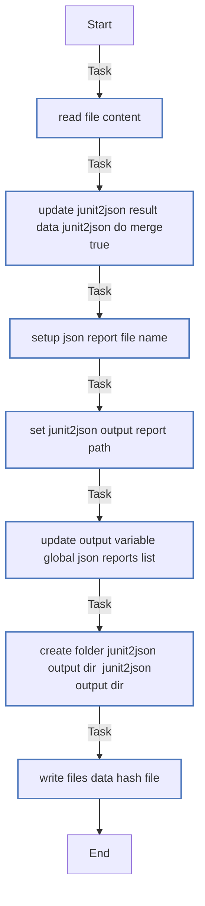
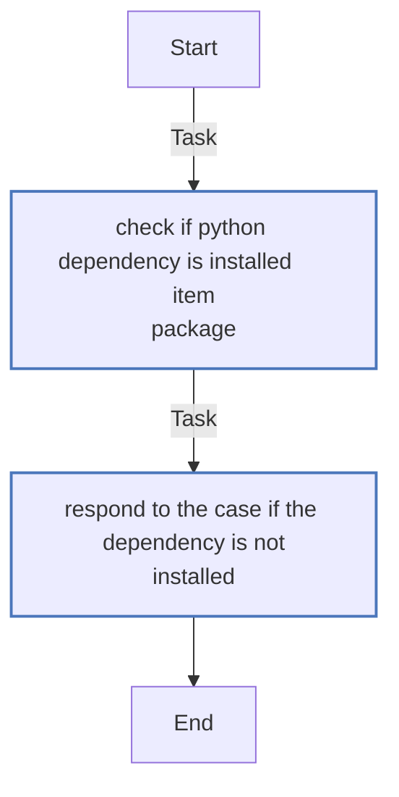
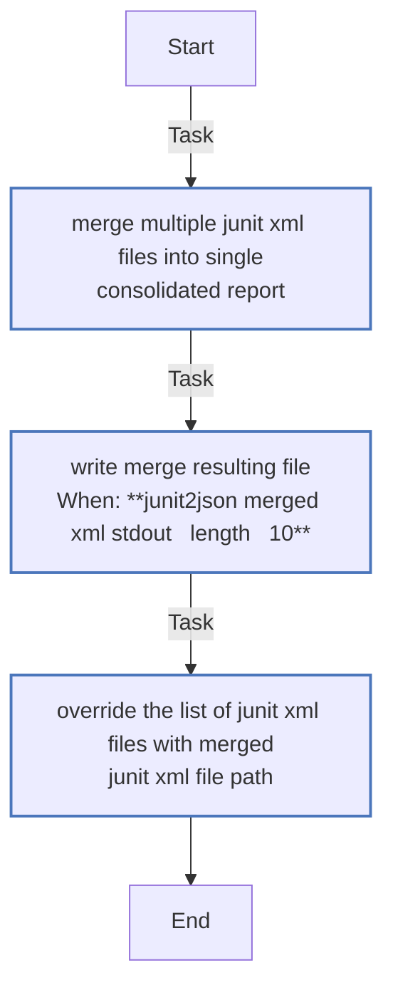
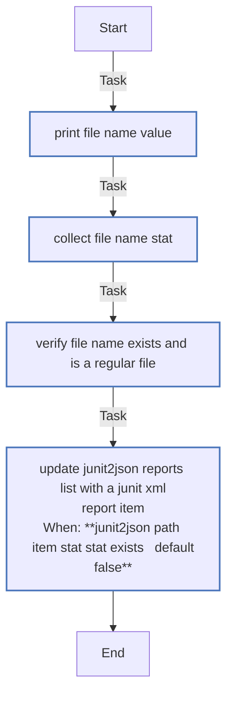
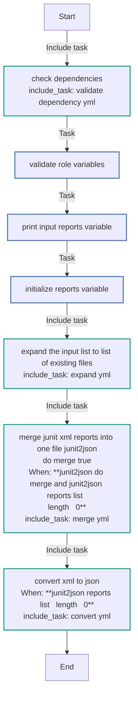
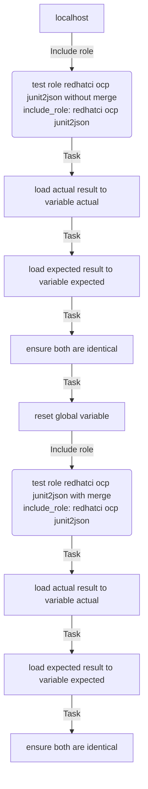

<!-- DOCSIBLE START -->

# 📃 Role overview

## junit2json


Description: Converts XML junit reports passed or in passed directory into single or fragmented JSON report file(s)


<details>
<summary><b>🧩 Argument Specifications in meta/argument_specs</b></summary>

#### Key: main 
**Description**: The resulting JSON file(s) are of the same structure for all the teams' and CI systems and used later to be sent to the data collection system.
This is the main entrypoint for the role `redhatci.ocp.junit2json`.
Converts XMLs into JSON, if variable `junit2json_do_merge` is `true`, multiple XMLs are merged into one XML file.
New filename(s) is(are) based on the old ones and stored in global variable `global_json_reports_list`.


  - **junit2json_input_reports_list**
    - **Required**: True
    - **Type**: list
    - **Default**: none
    - **Description**: List of JUnit XML report files to convert to JSON

  
  
  

  - **junit2json_do_merge**
    - **Required**: False
    - **Type**: bool
    - **Default**: True
    - **Description**: Should we merge data of converted reports into 1 file or not.
When `false`, each report `XML` file is converted to a corresponding json file appended `.json` extension
Otherwise, resulting merged report is named as the directory, with `.report.json` extension.
in both cases, the result is stored under `junit2json_output_dir`.

  
  
  

  - **junit2json_output_dir**
    - **Required**: True
    - **Type**: str
    - **Default**: none
    - **Description**: Output directory for resulting report JSON file path(s)

  
  
  

  - **junit2json_input_merged_report**
    - **Required**: False
    - **Type**: str
    - **Default**: merged.junit.xml
    - **Description**: Relative file name for the Merged XML report (relevant only when `junit2json_do_merge` is `true`),
it is generated under `junit2json_output_dir`

  
  
  

  - **junit2json_output_merged_report**
    - **Required**: False
    - **Type**: str
    - **Default**: merged.junit.json
    - **Description**: Relative file name for the JSON report (relevant only when `junit2json_do_merge` is `true`),
it is generated under `junit2json_output_dir`

  
  
  

  - **global_json_reports_list**
    - **Required**: False
    - **Type**: list
    - **Default**: []
    - **Description**: This is the output variable updated by the role for the converted JSON reports file names.
If it is defined outside of the role, the role updates it.

  
  
  


</details>


### Defaults

**These are static variables with lower priority**

#### File: defaults/main.yml

| Var          | Type         | Value       |Required    | Title       |
|--------------|--------------|-------------|-------------|-------------|
| [global_json_reports_list](defaults/main.yml#L6)   | list   | `[]` |    n/a  |  n/a |
| [junit2json_input_merged_report](defaults/main.yml#L9)   | str   | `merged.junit.xml` |    n/a  |  n/a |
| [junit2json_output_merged_report](defaults/main.yml#L10)   | str   | `merged.junit.json` |    n/a  |  n/a |
| [junit2json_do_merge](defaults/main.yml#L11)   | bool   | `True` |    n/a  |  n/a |


### Tasks


#### File: tasks/convert.yml

| Name | Module | Has Conditions |
| ---- | ------ | --------- |
| Read file content | ansible.builtin.set_fact | False |
| Update junit2json_result_data junit2json_do_merge=true | ansible.builtin.set_fact | False |
| Setup JSON report file name | ansible.builtin.set_fact | False |
| Set junit2json_output_report_path | ansible.builtin.set_fact | False |
| Update output variable global_json_reports_list | ansible.builtin.set_fact | False |
| Create folder junit2json_output_dir='{{ junit2json_output_dir }}' | ansible.builtin.file | False |
| Write files - data + hash file | ansible.builtin.copy | False |

#### File: tasks/validate-dependency.yml

| Name | Module | Has Conditions |
| ---- | ------ | --------- |
| Check if python dependency is installed - {{ item.package }} | ansible.builtin.command | False |
| Respond to the case if the dependency is not installed | ansible.builtin.assert | False |

#### File: tasks/merge.yml

| Name | Module | Has Conditions |
| ---- | ------ | --------- |
| Merge multiple JUnit XML files into single consolidated report | ansible.builtin.command | False |
| Write merge resulting file | ansible.builtin.copy | True |
| Override the list of JUnit XML files with merged JUnit XML file path | ansible.builtin.set_fact | False |

#### File: tasks/expand.yml

| Name | Module | Has Conditions |
| ---- | ------ | --------- |
| Print file_name value | ansible.builtin.debug | False |
| Collect file_name stat | ansible.builtin.stat | False |
| Verify file_name exists and is a regular file | ansible.builtin.assert | False |
| Update junit2json_reports_list with a JUnit XML report item | ansible.builtin.set_fact | True |

#### File: tasks/main.yml

| Name | Module | Has Conditions |
| ---- | ------ | --------- |
| Check dependencies | ansible.builtin.include_tasks | False |
| Validate role variables | ansible.builtin.assert | False |
| Print input reports variable | ansible.builtin.debug | False |
| Initialize reports variable | ansible.builtin.set_fact | False |
| Expand the input list to list of existing files | ansible.builtin.include_tasks | False |
| Merge JUnit XML reports into one file junit2json_do_merge=true | ansible.builtin.include_tasks | True |
| Convert XML to JSON | ansible.builtin.include_tasks | True |


## Task Flow Graphs


### Graph for convert.yml




### Graph for validate-dependency.yml




### Graph for merge.yml




### Graph for expand.yml




### Graph for main.yml




## Playbook

```yml
---

- name: "Test redhatci.ocp.junit2json role :: simple input"
  hosts: localhost
  vars:
    junit2json_output_merged_report: 'merged.junit.json'
  tasks:
    - name: Test role redhatci.ocp.junit2json without merge
      ansible.builtin.include_role:
        name: redhatci.ocp.junit2json
      vars:
        junit2json_input_reports_list:
          - "{{ role_path }}/../../tests/unit/data/test_junit2obj_simple_input.xml"
        junit2json_output_dir: "{{ role_path }}/tests"
        junit2json_do_merge: false
    - name: Load actual result to variable actual
      ansible.builtin.set_fact:
        actual: "{{ lookup('file', playbook_dir + '/test_junit2obj_simple_input.json') | from_json }}"
    - name: Load expected result to variable expected
      ansible.builtin.set_fact:
        expected: "{{ lookup('file', playbook_dir + '/../../../tests/unit/data/test_junit2obj_simple_result.json') }}"
    - name: Ensure both are identical
      ansible.builtin.assert:
        that:
          - actual == expected
    - name: Reset global variable
      ansible.builtin.set_fact:
        global_json_reports_list: []
    - name: Test role redhatci.ocp.junit2json with merge
      ansible.builtin.include_role:
        name: redhatci.ocp.junit2json
      vars:
        junit2json_input_reports_list:
          - "{{ role_path }}/../../tests/unit/data/test_junit2obj_simple_input.xml"
          - "{{ role_path }}/../../tests/unit/data/test_junit2obj_failure_input.xml"
        junit2json_output_dir: "{{ role_path }}/tests"
        junit2json_do_merge: true
    - name: Load actual result to variable actual
      ansible.builtin.set_fact:
        actual: "{{ lookup('file', global_json_reports_list[0]) | from_json }}"
    - name: Load expected result to variable expected
      ansible.builtin.set_fact:
        expected: "{{ lookup('file', playbook_dir + '/../../../tests/unit/data/' + junit2json_output_merged_report) }}"
    - name: Ensure both are identical
      ansible.builtin.assert:
        that:
          - actual == expected

```
## Playbook graph


## Author Information
Max Kovgan

#### License

Apache-2.0

#### Minimum Ansible Version

2.9

#### Platforms

No platforms specified.
<!-- DOCSIBLE END -->