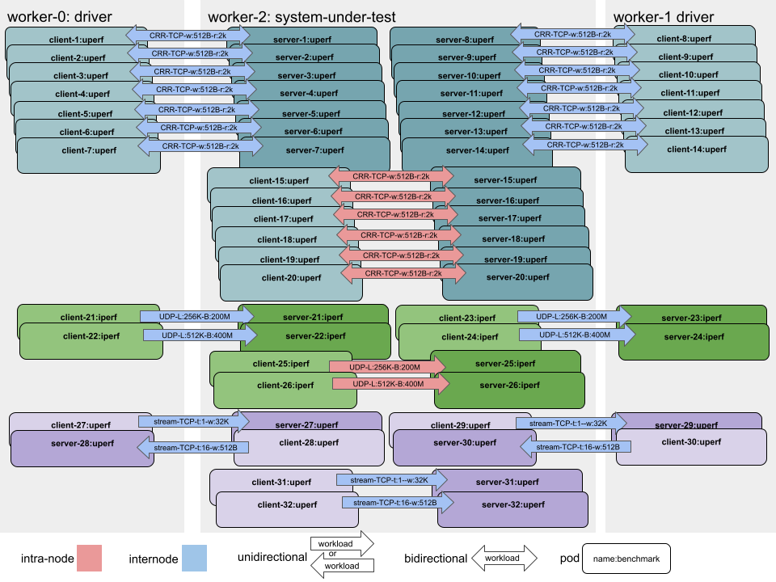

# Multi-bench role
This role is a standard procedure to launch a [Multi-bench](https://github.com/perftool-incubator/crucible) test.
It uses a pre-existing VM/host where all the crucible binaries are ready.

## Requirements
* A PerformanceProfile must be correctly setup on your OCP before launching this playbook.
* The multibench_host should have been prepared before running this role [with this playbook](https://github.com/redhatci/ansible-collection-redhatci-ocp/playbooks/multibench_setup_host.yml).

## Variables
| Variable                  | Default                                                 | Type      | Required | Description                                                                                              |
|---------------------------|---------------------------------------------------------|-----------|----------|----------------------------------------------------------------------------------------------------------|
| multibench_run_output_dir | None, automatically generated if not defined            | directory | false    | Directory where the results of the bench are copied                                                      |
| multibench_sample         | 3                                                       | Integer   | false    | Number of times the benchmark will be run                                                                |
| ocp_host                  | Host with a working oc connection                       | string    | true     | Address of the host which has a valid kubeconfig, accessible with SSH                                    |
| multibench_script         | run.sh	                                                 | string    | false    | Name of the script to be executed for launching the crucible cmd. Located in the `multibench_script_dir` |
| multibench_script_dir     | /root/crucible-examples/multibench/openshift/example-A	 | string    | false    | Path of the multibench script on the multi-bench host                                                    |
| multibench_tags           | automation:ansible                                      | key:value | false    | Tag to be added to the multi-bench Run in the Opensearch DB                                              |

## Presentation of the workload
By default, the workload launched by default is the example-A of Multi-bench, composed of 2 uperf scenarios and 1 iperf.


If you want to customize the scenarios, you can edit the `run.sh` file which defines the previous layout of test.
You can edit the resources requested by the pods (clients or servers), in order to have a Guaranteed QoS.
You can change the variable `multibench_script` to keep several scenarios ready and easily switch from one to another.

## Example - how to use the role
In this example, the two mandatory variables for the role are defined in the Ansible inventory:

```yaml
- name: "Include role multi-bench"
  include_role:
    name: redhatci.ocp.multibench_run
  vars:
    ocp_host: "{{ groups['provisioner'] | first }}"
    multibench_host: "{{ groups['multibench'] | first }}"
```

The example above works only if `multibench` is defined in the inventory:
A host `multibench` should be defined in the Ansible inventory like so:
```yaml
  children:
    multibench:
      hosts:
        my-host.my-lab:
          ansible_user: root
```