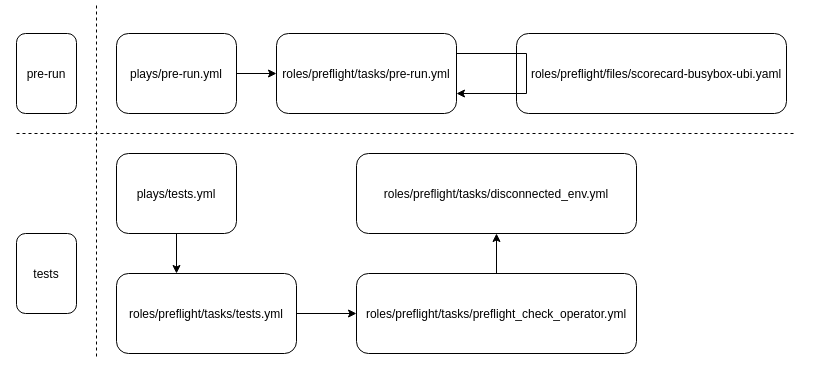

# Preflight cert suite Role

Preflight is a commandline interface for validating if OpenShift operator bundles and containers meet minimum requirements for Red Hat OpenShift Certification.

This role implements the preflight test suite as part of DCI Application Agent.

## Variables

Name                               | Default                                              | Description
---------------------------------- | ---------------------------------------------------- | -------------------------------------------------------------
preflight\_version                 | quay.io/opdev/preflight:1.0.6                        | [Version of Preflight Cert Suite to run](https://quay.io/repository/opdev/preflight?tab=tags)
preflight\_operators\_to\_check    | undefined                                            | List of operators to be checked with Preflight Cert Suite. This variable is mandatory to run Preflight cert suite. Please check [example_preflight_config.yaml](#example-of-config-file-to-define-a-list-of-operators-to-check) for the example.
operator\_sdk\_tool\_path          | undefined                                            | Path to operator-sdk binary, optional. Please check [example_preflight_config.yaml](#example-of-config-file-to-define-a-list-of-operators-to-check) for the example.
preflight\_namespace               | preflight-testing                                    | Namespace to use for preflight tests
submit\_preflight\_to\_pyxis       | false                                                | Should be set to true to submit Preflight results to Pyxis. Please do not forget to provide Pyxis credentials: pyxis\_apikey\_path with Pyxis token (shared for all projects within one client) and pyxis\_identifier (each operator should have its own certification project with the unique identifier).
pyxis\_apikey\_path                | undefined                                            | This is a path to file that contains partner's token. Parner should generate this token in connect.redhat.com. The token is shared for all projects within one partner.
pyxis\_identifier                  | undefined                                            | Each operator should have its own certification project with the unique identifier. If the partner has to certify two operators, he has to create two certification projects. Once a new cert project is created, the identifier could be extracted from the project url: https://connect.redhat.com/projects/pyxis_identifier/overview


## Role structure



## Example of config file to define a list of operators to check

```yaml
---
# preflight-config.yaml
operator_sdk_tool_path: "/usr/local/bin/operator-sdk-flag"

preflight_operators_to_check:
  - bundle_image: "quay.io/rh-nfv-int/testpmd-operator-bundle@sha256:5e28f883faacefa847104ebba1a1a22ee897b7576f0af6b8253c68b5c8f42815"
    index_image: "quay.io/rh-nfv-int/nfv-example-cnf-catalog:v0.2.9"
  - bundle_image: "quay.io/opdev/simple-demo-operator-bundle@sha256:eff7f86a54ef2a340dbf739ef955ab50397bef70f26147ed999e989cfc116b79"
    index_image: "quay.io/opdev/simple-demo-operator-catalog:v0.0.3"
...
```

**Mandatory** `preflight_operators_to_check` should be provided to run preflight or operator-sdk tests.

**Optional** `operator_sdk_tool_path` should be provided to run operator-sdk scorecard tests.
Here is the invocation:

```console
dci-openshift-app-agent-ctl -s -- -v \
-e kubeconfig_path=path/to/kubeconfig \
-e @preflight_config.yaml
```
