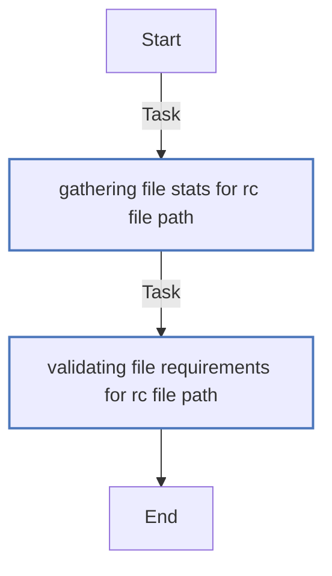
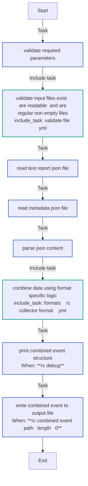
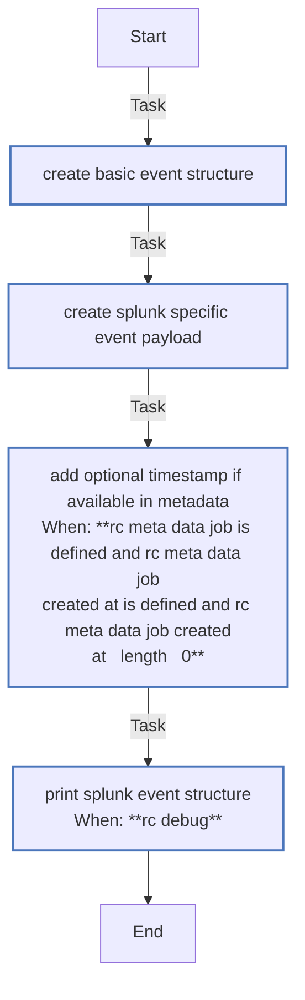
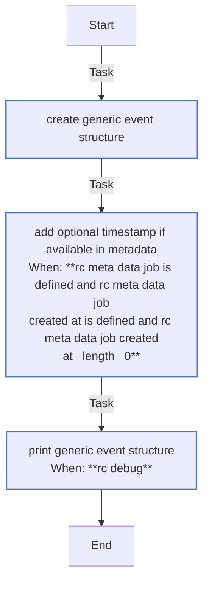

<!-- DOCSIBLE START -->

# 📃 Role overview

## report_combine

Description: Role to combine test reports and metadata into event structures for collectors

<b>🧩 Argument Specifications in meta/argument_specs</b>

#### Key: main 
**Description**: This role combines test report JSON and metadata JSON files into
collector-specific event structures. It supports multiple output formats
including Splunk HEC format and generic formats.

  - **rc_report_path**
    - **Required**: True
    - **Type**: str
    - **Default**: none
    - **Description**: Path to the test report JSON file
  
  
  

  - **rc_metadata_path**
    - **Required**: True
    - **Type**: str
    - **Default**: none
    - **Description**: Path to the metadata JSON file
  
  
  

  - **rc_combined_event_path**
    - **Required**: False
    - **Type**: str
    - **Default**: {{ playbook_dir }}/combined-event.json
    - **Description**: Path where to save the combined event JSON file
  
  
  

  - **rc_collector_format**
    - **Required**: False
    - **Type**: str
    - **Default**: splunk
    - **Description**: Format for the combined event structure
  
      - **Choices**: 
    
          - splunk
    
          - generic
    
  
  
  

  - **rc_event_source**
    - **Required**: False
    - **Type**: str
    - **Default**: {{ ansible_hostname }}
    - **Description**: Event source identifier
  
  
  

  - **rc_event_host**
    - **Required**: False
    - **Type**: str
    - **Default**: {{ ansible_hostname }}
    - **Description**: Event host identifier
  
  
  

  - **rc_debug**
    - **Required**: False
    - **Type**: bool
    - **Default**: False
    - **Description**: Enable debug output
  
  
  

### Defaults

**These are static variables with lower priority**

#### File: defaults/main.yml

| Var          | Type         | Value       |Required    | Title       |
|--------------|--------------|-------------|-------------|-------------|
| [rc_report_path](defaults/main.yml#L6)   | str   | `` |    n/a  |  n/a |
| [rc_metadata_path](defaults/main.yml#L7)   | str   | `` |    n/a  |  n/a |
| [rc_combined_event_path](defaults/main.yml#L10)   | str   | `{{ playbook_dir }}/combined-event.json` |    n/a  |  n/a |
| [rc_event_source](defaults/main.yml#L13)   | str   | `{{ ansible_hostname }}` |    n/a  |  n/a |
| [rc_event_host](defaults/main.yml#L14)   | str   | `{{ ansible_hostname }}` |    n/a  |  n/a |
| [rc_event_sourcetype](defaults/main.yml#L15)   | str   | `_json` |    n/a  |  n/a |
| [rc_collector_format](defaults/main.yml#L18)   | str   | `splunk` |    n/a  |  n/a |
| [rc_supported_formats](defaults/main.yml#L19)   | list   | `['splunk', 'generic']` |    n/a  |  n/a |
| [rc_debug](defaults/main.yml#L24)   | bool   | `False` |    n/a  |  n/a |
| [rc_test_data](defaults/main.yml#L27)   | dict   | `{}` |    n/a  |  n/a |
| [rc_meta_data](defaults/main.yml#L28)   | dict   | `{}` |    n/a  |  n/a |
| [rc_combined_event](defaults/main.yml#L29)   | dict   | `{}` |    n/a  |  n/a |

### Tasks

#### File: tasks/validate-file.yml

| Name | Module | Has Conditions |
| ---- | ------ | --------- |
| Gathering file stats for {{ rc_file_path }} | ansible.builtin.stat | False |
| Validating file requirements for {{ rc_file_path }} | ansible.builtin.assert | False |

#### File: tasks/main.yml

| Name | Module | Has Conditions |
| ---- | ------ | --------- |
| Validate required parameters | ansible.builtin.assert | False |
| Validate input files exist, are readable, and are regular non-empty files | ansible.builtin.include_tasks | False |
| Read test report JSON file | ansible.builtin.slurp | False |
| Read metadata JSON file | ansible.builtin.slurp | False |
| Parse JSON content | ansible.builtin.set_fact | False |
| Combine data using format-specific logic | ansible.builtin.include_tasks | False |
| Print combined event structure | ansible.builtin.debug | True |
| Write combined event to output file | ansible.builtin.copy | True |

#### File: tasks/formats/splunk.yml

| Name | Module | Has Conditions |
| ---- | ------ | --------- |
| Create basic event structure | ansible.builtin.set_fact | False |
| Create Splunk-specific event payload | ansible.builtin.set_fact | False |
| Add optional timestamp if available in metadata | ansible.builtin.set_fact | True |
| Print Splunk event structure | ansible.builtin.debug | True |

#### File: tasks/formats/generic.yml

| Name | Module | Has Conditions |
| ---- | ------ | --------- |
| Create generic event structure | ansible.builtin.set_fact | False |
| Add optional timestamp if available in metadata | ansible.builtin.set_fact | True |
| Print generic event structure | ansible.builtin.debug | True |

## Task Flow Graphs

### Graph for validate-file.yml

### Graph for main.yml

### Graph for formats/splunk.yml

### Graph for formats/generic.yml

## Author Information
Red Hat CI

#### License

Apache-2.0

#### Minimum Ansible Version

2.14

#### Platforms

- **EL**: ['8', '9']
- **Fedora**: ['37', '38', '39']

<!-- DOCSIBLE END -->