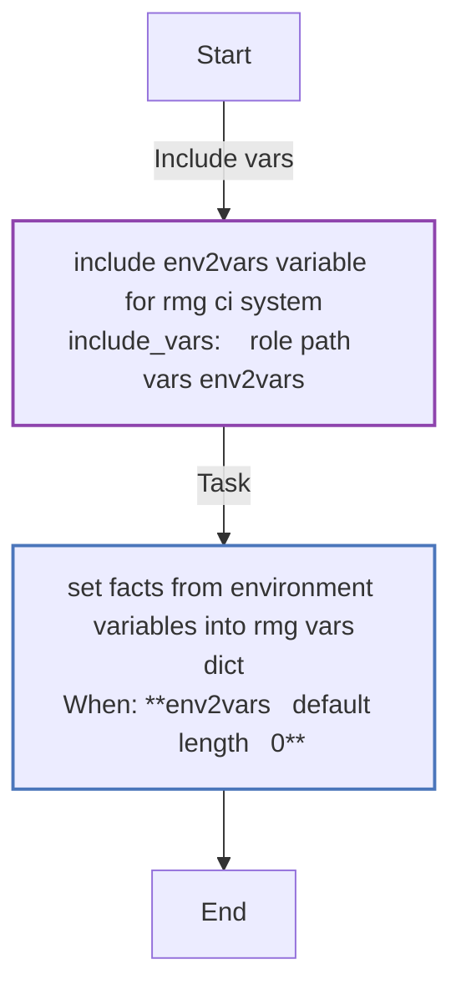
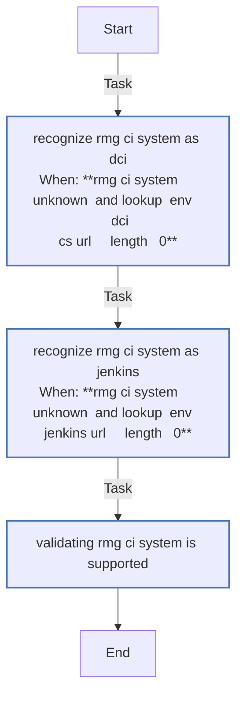
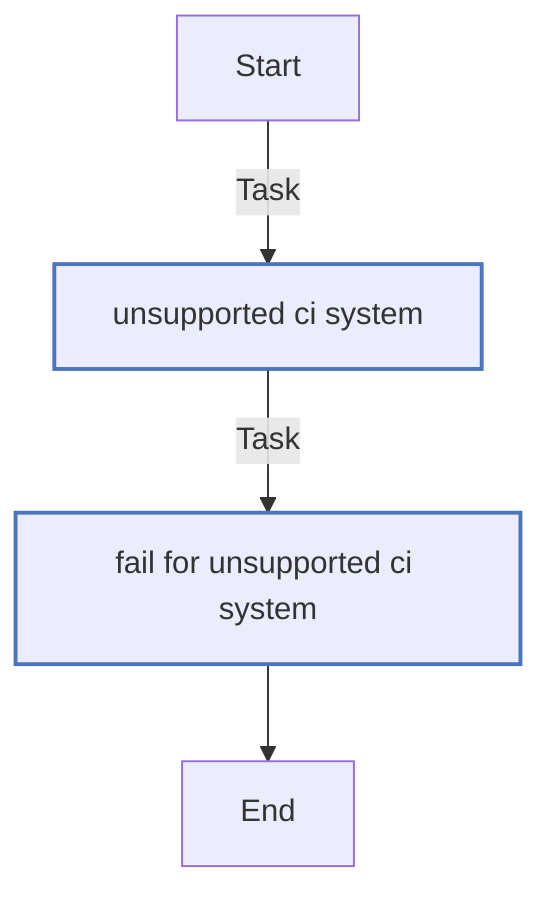

<!-- DOCSIBLE START -->

# 📃 Role overview

## report_metadata_gen

Description: Role to generate CI metadata for test reporting

### Defaults

**These are static variables with lower priority**

#### File: defaults/main.yml

| Var          | Type         | Value       |Required    | Title       |
|--------------|--------------|-------------|-------------|-------------|
| [rmg_ci_system](defaults/main.yml#L6)   | str   | `unknown` |    n/a  |  n/a |
| [rmg_ci_system_autodetect](defaults/main.yml#L7)   | bool   | `True` |    n/a  |  n/a |
| [rmg_ci_systems_supported](defaults/main.yml#L10)   | list   | `['dci', 'jenkins', 'unknown']` |    n/a  |  n/a |
| [rmg_metadata_output_path](defaults/main.yml#L16)   | str   | `{{ playbook_dir }}/metadata.json` |    n/a  |  n/a |
| [rmg_metadata_output_format](defaults/main.yml#L17)   | str   | `json` |    n/a  |  n/a |
| [rmg_default_ts](defaults/main.yml#L20)   | str   | `{{ now(fmt='%Y-%m-%dT%H:%M:%S') }}` |    n/a  |  n/a |
| [rmg_debug](defaults/main.yml#L23)   | bool   | `False` |    n/a  |  n/a |
| [rmg_ci_runtime](defaults/main.yml#L26)   | dict   | `{}` |    n/a  |  n/a |
| [rmg_meta_data](defaults/main.yml#L27)   | dict   | `{}` |    n/a  |  n/a |
| [rmg_existing_metadata](defaults/main.yml#L30)   | dict   | `{}` |    n/a  |  n/a |

### Tasks

#### File: tasks/env2vars-populate.yml

| Name | Module | Has Conditions |
| ---- | ------ | --------- |
| Include env2vars variable for {{ rmg_ci_system }} | ansible.builtin.include_vars | False |
| Set facts from environment variables into rmg_vars_dict | ansible.builtin.set_fact | True |

#### File: tasks/ci-detect.yml

| Name | Module | Has Conditions |
| ---- | ------ | --------- |
| Recognize rmg_ci_system as DCI | ansible.builtin.set_fact | True |
| Recognize rmg_ci_system as Jenkins | ansible.builtin.set_fact | True |
| Validating rmg_ci_system is supported | ansible.builtin.assert | False |

#### File: tasks/main.yml

| Name | Module | Has Conditions |
| ---- | ------ | --------- |
| Initialize metadata with existing data | ansible.builtin.set_fact | False |
| Initialize rmg_ci_runtime | ansible.builtin.set_fact | False |
| CI system auto-detection | ansible.builtin.include_tasks | True |
| Validate CI system is supported | ansible.builtin.assert | False |
| Include variables for {{ rmg_ci_system }} | ansible.builtin.include_vars | True |
| Detect dynamic metadata from environment | ansible.builtin.include_tasks | True |
| Generate CI-specific metadata | ansible.builtin.include_tasks | False |
| Print generated metadata | ansible.builtin.debug | True |
| Update metadata with runtime data | ansible.builtin.set_fact | False |
| Write metadata to output file | ansible.builtin.copy | True |

#### File: tasks/ci-metadata/jenkins.yml

| Name | Module | Has Conditions |
| ---- | ------ | --------- |
| Update is_ci in rmg_ci_runtime attribute for {{ rmg_ci_system }} | ansible.builtin.set_fact | False |
| Update helper variables for ci attributes for {{ trs_ci_system }} | ansible.builtin.set_fact | False |
| Update helper variables for ci attributes for {{ rmg_ci_system }} | ansible.builtin.set_fact | False |
| Update helper variables for ci_runner attributes for {{ rmg_ci_system }} | ansible.builtin.set_fact | False |
| Update helper variables for rmg_ci_runtime attributes for {{ rmg_ci_system }} | ansible.builtin.set_fact | False |
| Update helper variables for job attributes for {{ rmg_ci_system }} | ansible.builtin.set_fact | False |
| Update helper variables for source attributes for {{ rmg_ci_system }} | ansible.builtin.set_fact | False |
| Update helper variables for source_change attributes for {{ rmg_ci_system }} | ansible.builtin.set_fact | False |
| Update helper variables for source attributes for {{ rmg_ci_system }} | ansible.builtin.set_fact | False |
| Construct the final rmg_ci_runtime metadata dictionary for {{ rmg_ci_system }} | ansible.builtin.set_fact | False |

#### File: tasks/ci-metadata/dci.yml

| Name | Module | Has Conditions |
| ---- | ------ | --------- |
| Set is_ci attribute | ansible.builtin.set_fact | True |
| Update rmg_ci_runtime.type for {{ rmg_ci_system }} | ansible.builtin.set_fact | False |
| Update rmg_ci_runtime.url for {{ rmg_ci_system }} | ansible.builtin.set_fact | False |
| Print rmg_meta_data (Before squash of metadata key) | ansible.builtin.debug | False |
| Update ci in metadata | ansible.builtin.set_fact | False |
| Merge "metadata" into root rmg_meta_data | ansible.builtin.set_fact | True |
| Print rmg_meta_data (AFTER squash of metadata key) | ansible.builtin.debug | False |
| Delete rmg_meta_data key "metadata" | ansible.builtin.set_fact | True |
| Print rmg_meta_data (AFTER deleting of metadata key) | ansible.builtin.debug | False |

#### File: tasks/ci-metadata/unknown.yml

| Name | Module | Has Conditions |
| ---- | ------ | --------- |
| Unsupported CI system | ansible.builtin.debug | False |
| Fail for unsupported CI system | ansible.builtin.fail | False |

## Task Flow Graphs

### Graph for env2vars-populate.yml

### Graph for ci-detect.yml

### Graph for main.yml

```mermaid
flowchart TD
Start
classDef block stroke:#3498db,stroke-width:2px;
classDef task stroke:#4b76bb,stroke-width:2px;
classDef includeTasks stroke:#16a085,stroke-width:2px;
classDef importTasks stroke:#34495e,stroke-width:2px;
classDef includeRole stroke:#2980b9,stroke-width:2px;
classDef importRole stroke:#699ba7,stroke-width:2px;
classDef includeVars stroke:#8e44ad,stroke-width:2px;
classDef rescue stroke:#665352,stroke-width:2px;

  Start-->|Task| Initialize_metadata_with_existing_data0[initialize metadata with existing data]:::task
  Initialize_metadata_with_existing_data0-->|Task| Initialize_rmg_ci_runtime1[initialize rmg ci runtime]:::task
  Initialize_rmg_ci_runtime1-->|Include task| ci_detect_yml2[ci system auto detection<br>When: **rmg ci system autodetect**<br>include_task: ci detect yml]:::includeTasks
  ci_detect_yml2-->|Task| Validate_CI_system_is_supported3[validate ci system is supported]:::task
  Validate_CI_system_is_supported3-->|Include vars| vars4[include variables for rmg ci system<br>When: **rmg ci system     unknown**<br>include_vars: vars]:::includeVars
  vars4-->|Include task| env2vars_populate_yml5[detect dynamic metadata from environment<br>When: **rmg ci system     unknown**<br>include_task: env2vars populate yml]:::includeTasks
  env2vars_populate_yml5-->|Include task| ci_metadata____rmg_ci_system____yml6[generate ci specific metadata<br>include_task: ci metadata    rmg ci system    yml]:::includeTasks
  ci_metadata____rmg_ci_system____yml6-->|Task| Print_generated_metadata7[print generated metadata<br>When: **rmg debug**]:::task
  Print_generated_metadata7-->|Task| Update_metadata_with_runtime_data8[update metadata with runtime data]:::task
  Update_metadata_with_runtime_data8-->|Task| Write_metadata_to_output_file9[write metadata to output file<br>When: **rmg metadata output path   length   0**]:::task
  Write_metadata_to_output_file9-->End
```

### Graph for ci-metadata/jenkins.yml

```mermaid
flowchart TD
Start
classDef block stroke:#3498db,stroke-width:2px;
classDef task stroke:#4b76bb,stroke-width:2px;
classDef includeTasks stroke:#16a085,stroke-width:2px;
classDef importTasks stroke:#34495e,stroke-width:2px;
classDef includeRole stroke:#2980b9,stroke-width:2px;
classDef importRole stroke:#699ba7,stroke-width:2px;
classDef includeVars stroke:#8e44ad,stroke-width:2px;
classDef rescue stroke:#665352,stroke-width:2px;

  Start-->|Task| Update_is_ci_in_rmg_ci_runtime_attribute_for_rmg_ci_system0[update is ci in rmg ci runtime attribute for rmg<br>ci system]:::task
  Update_is_ci_in_rmg_ci_runtime_attribute_for_rmg_ci_system0-->|Task| Update_helper_variables_for_ci_attributes_for_trs_ci_system1[update helper variables for ci attributes for trs<br>ci system]:::task
  Update_helper_variables_for_ci_attributes_for_trs_ci_system1-->|Task| Update_helper_variables_for_ci_attributes_for_rmg_ci_system2[update helper variables for ci attributes for rmg<br>ci system]:::task
  Update_helper_variables_for_ci_attributes_for_rmg_ci_system2-->|Task| Update_helper_variables_for_ci_runner_attributes_for_rmg_ci_system3[update helper variables for ci runner attributes<br>for rmg ci system]:::task
  Update_helper_variables_for_ci_runner_attributes_for_rmg_ci_system3-->|Task| Update_helper_variables_for_rmg_ci_runtime_attributes_for_rmg_ci_system4[update helper variables for rmg ci runtime<br>attributes for rmg ci system]:::task
  Update_helper_variables_for_rmg_ci_runtime_attributes_for_rmg_ci_system4-->|Task| Update_helper_variables_for_job_attributes_for_rmg_ci_system5[update helper variables for job attributes for rmg<br>ci system]:::task
  Update_helper_variables_for_job_attributes_for_rmg_ci_system5-->|Task| Update_helper_variables_for_source_attributes_for_rmg_ci_system6[update helper variables for source attributes for<br>rmg ci system]:::task
  Update_helper_variables_for_source_attributes_for_rmg_ci_system6-->|Task| Update_helper_variables_for_source_change_attributes_for_rmg_ci_system7[update helper variables for source change<br>attributes for rmg ci system]:::task
  Update_helper_variables_for_source_change_attributes_for_rmg_ci_system7-->|Task| Update_helper_variables_for_source_attributes_for_rmg_ci_system8[update helper variables for source attributes for<br>rmg ci system]:::task
  Update_helper_variables_for_source_attributes_for_rmg_ci_system8-->|Task| Construct_the_final_rmg_ci_runtime_metadata_dictionary_for_rmg_ci_system9[construct the final rmg ci runtime metadata<br>dictionary for rmg ci system]:::task
  Construct_the_final_rmg_ci_runtime_metadata_dictionary_for_rmg_ci_system9-->End
```

### Graph for ci-metadata/dci.yml

```mermaid
flowchart TD
Start
classDef block stroke:#3498db,stroke-width:2px;
classDef task stroke:#4b76bb,stroke-width:2px;
classDef includeTasks stroke:#16a085,stroke-width:2px;
classDef importTasks stroke:#34495e,stroke-width:2px;
classDef includeRole stroke:#2980b9,stroke-width:2px;
classDef importRole stroke:#699ba7,stroke-width:2px;
classDef includeVars stroke:#8e44ad,stroke-width:2px;
classDef rescue stroke:#665352,stroke-width:2px;

  Start-->|Task| Set_is_ci_attribute0[set is ci attribute<br>When: **lookup  env   ci     lower     true  and lookup <br>env   dci cs url   is defined**]:::task
  Set_is_ci_attribute0-->|Task| Update_rmg_ci_runtime_type_for_rmg_ci_system1[update rmg ci runtime type for rmg ci system]:::task
  Update_rmg_ci_runtime_type_for_rmg_ci_system1-->|Task| Update_rmg_ci_runtime_url_for_rmg_ci_system2[update rmg ci runtime url for rmg ci system]:::task
  Update_rmg_ci_runtime_url_for_rmg_ci_system2-->|Task| Print_rmg_meta_data__Before_squash_of_metadata_key_3[print rmg meta data  before squash of metadata key<br>]:::task
  Print_rmg_meta_data__Before_squash_of_metadata_key_3-->|Task| Update_ci_in_metadata4[update ci in metadata]:::task
  Update_ci_in_metadata4-->|Task| Merge__metadata__into_root_rmg_meta_data5[merge  metadata  into root rmg meta data<br>When: **rmg meta data   length   0 and   metadata  in rmg<br>meta data keys    and rmg meta data metadata  <br>length   0**]:::task
  Merge__metadata__into_root_rmg_meta_data5-->|Task| Print_rmg_meta_data__AFTER_squash_of_metadata_key_6[print rmg meta data  after squash of metadata key ]:::task
  Print_rmg_meta_data__AFTER_squash_of_metadata_key_6-->|Task| Delete_rmg_meta_data_key__metadata_7[delete rmg meta data key  metadata <br>When: **rmg meta data   length   0 and   metadata  in rmg<br>meta data keys    and rmg meta data metadata  <br>length   0**]:::task
  Delete_rmg_meta_data_key__metadata_7-->|Task| Print_rmg_meta_data__AFTER_deleting_of_metadata_key_8[print rmg meta data  after deleting of metadata<br>key ]:::task
  Print_rmg_meta_data__AFTER_deleting_of_metadata_key_8-->End
```

### Graph for ci-metadata/unknown.yml

## Author Information
Red Hat CI

#### License

Apache-2.0

#### Minimum Ansible Version

2.14

#### Platforms

- **EL**: ['8', '9']
- **Fedora**: ['37', '38', '39']

<!-- DOCSIBLE END -->