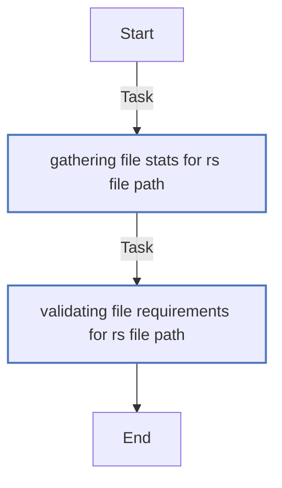
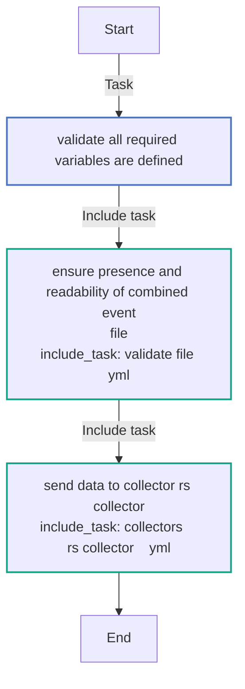

<!-- DOCSIBLE START -->

# 📃 Role overview

## report_send

Description: Role to send pre-combined event data to collectors

### Defaults

**These are static variables with lower priority**

#### File: defaults/main.yml

| Var          | Type         | Value       |Required    | Title       |
|--------------|--------------|-------------|-------------|-------------|
| [rs_combined_event_path](defaults/main.yml#L6)   | str   | `` |    n/a  |  n/a |
| [rs_collector](defaults/main.yml#L9)   | str   | `splunk` |    n/a  |  n/a |
| [rs_collector_url](defaults/main.yml#L10)   | str   | `` |    n/a  |  n/a |
| [rs_collector_target](defaults/main.yml#L11)   | str   | `` |    n/a  |  n/a |
| [rs_collector_source](defaults/main.yml#L12)   | str   | `` |    n/a  |  n/a |
| [rs_collector_auth_headers](defaults/main.yml#L15)   | dict   | `{}` |    n/a  |  n/a |
| [rs_collector_auth_token](defaults/main.yml#L16)   | str   | `` |    n/a  |  n/a |
| [rs_do_send](defaults/main.yml#L19)   | bool   | `True` |    n/a  |  n/a |
| [rs_allow_self_signed_certs](defaults/main.yml#L20)   | bool   | `False` |    n/a  |  n/a |
| [rs_debug](defaults/main.yml#L23)   | bool   | `False` |    n/a  |  n/a |
| [rs_event_save](defaults/main.yml#L24)   | str   | `{{ rs_debug ¦ default(false) }}` |    n/a  |  n/a |
| [rs_event_dump_file](defaults/main.yml#L25)   | str   | `{{ playbook_dir }}/event.json` |    n/a  |  n/a |
| [rs_collectors_supported](defaults/main.yml#L28)   | list   | `['splunk']` |    n/a  |  n/a |

### Tasks

#### File: tasks/validate-file.yml

| Name | Module | Has Conditions |
| ---- | ------ | --------- |
| Gathering file stats for {{ rs_file_path }} | ansible.builtin.stat | False |
| Validating file requirements for {{ rs_file_path }} | ansible.builtin.assert | False |

#### File: tasks/main.yml

| Name | Module | Has Conditions |
| ---- | ------ | --------- |
| Validate all required variables are defined | ansible.builtin.assert | False |
| Ensure presence and readability of combined event file | ansible.builtin.include_tasks | False |
| Send data to collector {{ rs_collector }} | ansible.builtin.include_tasks | False |

#### File: tasks/collectors/splunk.yml

| Name | Module | Has Conditions |
| ---- | ------ | --------- |
| Read combined event JSON file | ansible.builtin.slurp | False |
| Parse combined event JSON | ansible.builtin.set_fact | False |
| Update rs_collector_auth_headers with rs_collector_auth_token for {{ rs_collector }} | ansible.builtin.set_fact | True |
| Update rs_collector_auth_headers with rs_collector_target for {{ rs_collector }} | ansible.builtin.set_fact | True |
| Override source in event payload if specified | ansible.builtin.set_fact | True |
| Save event to file for debugging | ansible.builtin.copy | True |
| Send data to {{ rs_collector }} | ansible.builtin.uri | True |
| Verify status code is good | ansible.builtin.assert | True |

## Task Flow Graphs

### Graph for validate-file.yml

### Graph for main.yml

### Graph for collectors/splunk.yml

```mermaid
flowchart TD
Start
classDef block stroke:#3498db,stroke-width:2px;
classDef task stroke:#4b76bb,stroke-width:2px;
classDef includeTasks stroke:#16a085,stroke-width:2px;
classDef importTasks stroke:#34495e,stroke-width:2px;
classDef includeRole stroke:#2980b9,stroke-width:2px;
classDef importRole stroke:#699ba7,stroke-width:2px;
classDef includeVars stroke:#8e44ad,stroke-width:2px;
classDef rescue stroke:#665352,stroke-width:2px;

  Start-->|Task| Read_combined_event_JSON_file0[read combined event json file]:::task
  Read_combined_event_JSON_file0-->|Task| Parse_combined_event_JSON1[parse combined event json]:::task
  Parse_combined_event_JSON1-->|Task| Update_rs_collector_auth_headers_with_rs_collector_auth_token_for_rs_collector2[update rs collector auth headers with rs collector<br>auth token for rs collector<br>When: **rs collector auth token   default       length   0**]:::task
  Update_rs_collector_auth_headers_with_rs_collector_auth_token_for_rs_collector2-->|Task| Update_rs_collector_auth_headers_with_rs_collector_target_for_rs_collector3[update rs collector auth headers with rs collector<br>target for rs collector<br>When: **rs collector target   length   0**]:::task
  Update_rs_collector_auth_headers_with_rs_collector_target_for_rs_collector3-->|Task| Override_source_in_event_payload_if_specified4[override source in event payload if specified<br>When: **rs collector source   length   0**]:::task
  Override_source_in_event_payload_if_specified4-->|Task| Save_event_to_file_for_debugging5[save event to file for debugging<br>When: **rs event save   default false  and rs event dump<br>file   default       length   0**]:::task
  Save_event_to_file_for_debugging5-->|Task| Send_data_to_rs_collector6[send data to rs collector<br>When: **rs do send   default false**]:::task
  Send_data_to_rs_collector6-->|Task| Verify_status_code_is_good7[verify status code is good<br>When: **rs do send   default false**]:::task
  Verify_status_code_is_good7-->End
```

## Author Information
Red Hat CI

#### License

Apache-2.0

#### Minimum Ansible Version

2.14

#### Platforms

- **EL**: ['8', '9']
- **Fedora**: ['37', '38', '39']

<!-- DOCSIBLE END -->