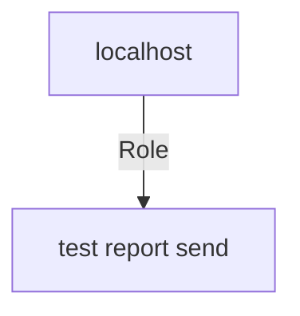

<!-- DOCSIBLE START -->

# 📃 Role overview

## test_report_send


Description: Push data file to collector


<details>
<summary><b>🧩 Argument Specifications in meta/argument_specs</b></summary>

#### Key: main 
**Description**: This is the main entrypoint for the `redhatci.ocp.test_report_send` role.
The role sends a single event made of `trs_report_file_path` and ``
It sends data to the collector, currently only splunk is supported.


  - **trs_report_path**
    - **Required**: True
    - **Type**: str
    - **Default**: none
    - **Description**: Test report JSON file to send.
Merged into the event under 'test' attribute.
For full report syntax see (TBD).

  
  
  

  - **trs_metadata_path**
    - **Required**: False
    - **Type**: str
    - **Default**: 
    - **Description**: Event metadata JSON file to send.
Merged into the event 'metadata' attribute.
Useful to mark special datasets during development.
If set to be empty or the file is missing, it is ignored.

  
  
  

  - **trs_collector_url**
    - **Required**: True
    - **Type**: str
    - **Default**: none
    - **Description**: The URL of collector server (Splunk).

  
  
  

  - **trs_collector_auth_headers**
    - **Required**: True
    - **Type**: dict
    - **Default**: none
    - **Description**: Authentication headers against the collector server (Splunk).

  
  
  


</details>


### Defaults

**These are static variables with lower priority**

#### File: defaults/main.yml

| Var          | Type         | Value       |Required    | Title       |
|--------------|--------------|-------------|-------------|-------------|
| [trs_metadata_path](defaults/main.yml#L5)   | str   | `` |    n/a  |  n/a |


### Tasks


#### File: tasks/main.yml

| Name | Module | Has Conditions |
| ---- | ------ | --------- |
| Verify all input variables are set | ansible.builtin.assert | False |
| Collect trs_report_path file stat | ansible.builtin.stat | False |
| Ensure trs_report_path file exists | ansible.builtin.assert | False |
| Read content from test report JSON file | ansible.builtin.slurp | False |
| Decode JSON content of test report file | ansible.builtin.set_fact | False |
| Collect trs_metadata_path file stat | ansible.builtin.stat | True |
| Read content of metadata JSON file | ansible.builtin.slurp | True |
| Setup content for metadata file | ansible.builtin.set_fact | False |
| Decode JSON content for metadata file | ansible.builtin.set_fact | True |
| Create event data attributes | ansible.builtin.set_fact | False |
| Setup timestamps broken down to int/float parts | ansible.builtin.set_fact | False |
| Setup timestamps as floats | ansible.builtin.set_fact | False |
| Set event time if we have job_time | ansible.builtin.set_fact | True |
| Print event data | ansible.builtin.debug | False |
| Combine additional attributes into the data | ansible.builtin.set_fact | False |
| Print payload data | ansible.builtin.debug | False |
| Send data to collector | ansible.builtin.uri | False |


## Task Flow Graphs


### Graph for main.yml

```mermaid
flowchart TD
Start
classDef block stroke:#3498db,stroke-width:2px;
classDef task stroke:#4b76bb,stroke-width:2px;
classDef includeTasks stroke:#16a085,stroke-width:2px;
classDef importTasks stroke:#34495e,stroke-width:2px;
classDef includeRole stroke:#2980b9,stroke-width:2px;
classDef importRole stroke:#699ba7,stroke-width:2px;
classDef includeVars stroke:#8e44ad,stroke-width:2px;
classDef rescue stroke:#665352,stroke-width:2px;

  Start-->|Task| Verify_all_input_variables_are_set0[verify all input variables are set]:::task
  Verify_all_input_variables_are_set0-->|Task| Collect_trs_report_path_file_stat1[collect trs report path file stat]:::task
  Collect_trs_report_path_file_stat1-->|Task| Ensure_trs_report_path_file_exists2[ensure trs report path file exists]:::task
  Ensure_trs_report_path_file_exists2-->|Task| Read_content_from_test_report_JSON_file3[read content from test report json file]:::task
  Read_content_from_test_report_JSON_file3-->|Task| Decode_JSON_content_of_test_report_file4[decode json content of test report file]:::task
  Decode_JSON_content_of_test_report_file4-->|Task| Collect_trs_metadata_path_file_stat5[collect trs metadata path file stat<br>When: **trs metadata path   default       length   0**]:::task
  Collect_trs_metadata_path_file_stat5-->|Task| Read_content_of_metadata_JSON_file6[read content of metadata json file<br>When: **trs metadata path stat stat isreg   default false<br>**]:::task
  Read_content_of_metadata_JSON_file6-->|Task| Setup_content_for_metadata_file7[setup content for metadata file]:::task
  Setup_content_for_metadata_file7-->|Task| Decode_JSON_content_for_metadata_file8[decode json content for metadata file<br>When: **trs metadata file content content   default      <br>length   0**]:::task
  Decode_JSON_content_for_metadata_file8-->|Task| Create_event_data_attributes9[create event data attributes]:::task
  Create_event_data_attributes9-->|Task| Setup_timestamps_broken_down_to_int_float_parts10[setup timestamps broken down to int float parts]:::task
  Setup_timestamps_broken_down_to_int_float_parts10-->|Task| Setup_timestamps_as_floats11[setup timestamps as floats]:::task
  Setup_timestamps_as_floats11-->|Task| Set_event_time_if_we_have_job_time12[set event time if we have job time<br>When: **trs job time int   int    0**]:::task
  Set_event_time_if_we_have_job_time12-->|Task| Print_event_data13[print event data]:::task
  Print_event_data13-->|Task| Combine_additional_attributes_into_the_data14[combine additional attributes into the data]:::task
  Combine_additional_attributes_into_the_data14-->|Task| Print_payload_data15[print payload data]:::task
  Print_payload_data15-->|Task| Send_data_to_collector16[send data to collector]:::task
  Send_data_to_collector16-->End
```




## Playbook

```yml
---
- hosts: localhost
  remote_user: root
  roles:
    - role: test_report_send
      

```
## Playbook graph


## Author Information
Max Kovgan, Cesare Placanica

#### License

Apache License, Version 2.0

#### Minimum Ansible Version

2.9

#### Platforms

No platforms specified.
<!-- DOCSIBLE END -->