<!-- DOCSIBLE START -->

# 📃 Role overview

## test_report_send


Description: Pushes JUnit XML files and its metadata to a collector


<details>
<summary><b>🧩 Argument Specifications in meta/argument_specs</b></summary>

#### Key: main 
**Description**: This is the main entrypoint for the role `redhatci.ocp.test_report_send`.
The role constructs a single event made of:

* tests report data: `trs_report_path`
* runtime metadata, either:
    * `trs_metadata_path`
    * CI-specific metadata collected from environment variables
This event is sent to the collector (currently only splunk is supported).


  - **trs_report_path**
    - **Required**: False
    - **Type**: str
    - **Default**: 
    - **Description**: Test report JSON file to send.
Merged into the event under 'test' attribute.
For full report syntax see [doc/event.md](ocp/role/test_report_send/doc/event.md).

  
  
  

  - **trs_metadata_path**
    - **Required**: False
    - **Type**: str
    - **Default**: 
    - **Description**: Event metadata JSON file to send.
Merged into the event 'metadata' attribute.
Useful to mark special datasets during development.
If set to be empty or the file is missing, it is ignored.

  
  
  

  - **trs_collector_url**
    - **Required**: True
    - **Type**: str
    - **Default**: none
    - **Description**: The URL of collector server (Splunk).

  
  
  

  - **trs_collector_auth_token**
    - **Required**: False
    - **Type**: str
    - **Default**: none
    - **Description**: Collector auth token string for Bearer Token HTTP Authentication.

  
  
  

  - **trs_collector_target**
    - **Required**: False
    - **Type**: str
    - **Default**: 
    - **Description**: Collector Target/Channel/Topic/Id

  
  
  

  - **trs_collector**
    - **Required**: False
    - **Type**: str
    - **Default**: splunk
    - **Description**: Collector type (currently only `splunk` is supported).

  
  
  

  - **trs_collector_source**
    - **Required**: False
    - **Type**: str
    - **Default**: 
    - **Description**: Collector source should contain detected or passed hostname generating the event.

  
  
  

  - **trs_collector_auth_headers**
    - **Required**: False
    - **Type**: dict
    - **Default**: {}
    - **Description**: Collector request HTTP headers for HTTP Authentication.

  
  
  

  - **trs_ci_system_autodetect**
    - **Required**: False
    - **Type**: bool
    - **Default**: True
    - **Description**: Perform auto-detection of CI system from environment.
Turning it Off is useful when debugging.

  
  
  

  - **trs_workdir**
    - **Required**: False
    - **Type**: str
    - **Default**: {{ playbook_dir }}/workdir
    - **Description**: Directory for intermediate files (usable for troubleshooting, files deleted unless `trs_workdir_keep` is true.
It is automatically set to true if `trs_debug` is set to `true`.

  
  
  

  - **trs_event_dump_file**
    - **Required**: False
    - **Type**: str
    - **Default**: {{ playbook_dir }}/event.json
    - **Description**: (For tests only) file name to dump the event json.
Used only if `trs_event_save` is set to `true`

  
  
  


</details>


### Defaults

**These are static variables with lower priority**

#### File: defaults/main.yml

| Var          | Type         | Value       |Required    | Title       |
|--------------|--------------|-------------|-------------|-------------|
| [trs_report_path](defaults/main.yml#L5)   | str   | `` |    n/a  |  n/a |
| [trs_metadata_path](defaults/main.yml#L6)   | str   | `` |    n/a  |  n/a |
| [trs_collector_source](defaults/main.yml#L7)   | str   | `` |    n/a  |  n/a |
| [trs_collector_target](defaults/main.yml#L8)   | str   | `` |    n/a  |  n/a |
| [trs_collector_auth_headers](defaults/main.yml#L9)   | dict   | `{}` |    n/a  |  n/a |
| [trs_collector_auth_token](defaults/main.yml#L10)   | str   | `` |    n/a  |  n/a |
| [trs_workdir](defaults/main.yml#L11)   | str   | `{{ playbook_dir }}/workdir` |    n/a  |  n/a |
| [trs_event_dump_file](defaults/main.yml#L12)   | str   | `{{ playbook_dir }}/event.json` |    n/a  |  n/a |
| [trs_ci_system](defaults/main.yml#L13)   | str   | `unknown` |    n/a  |  n/a |
| [trs_collector](defaults/main.yml#L14)   | str   | `splunk` |    n/a  |  n/a |
| [trs_debug](defaults/main.yml#L16)   | bool   | `False` |    n/a  |  n/a |
| [trs_ci_system_autodetect](defaults/main.yml#L18)   | bool   | `True` |    n/a  |  n/a |
| [trs_do_send](defaults/main.yml#L19)   | bool   | `True` |    n/a  |  n/a |
| [trs_event_save](defaults/main.yml#L20)   | str   | `{{ trs_debug ¦ default(false) }}` |    n/a  |  n/a |
| [trs_workdir_keep](defaults/main.yml#L21)   | str   | `{{ trs_debug ¦ default(false) }}` |    n/a  |  n/a |
| [trs_ci_runtime](defaults/main.yml#L23)   | dict   | `{}` |    n/a  |  n/a |
| [trs_meta_data](defaults/main.yml#L24)   | dict   | `{}` |    n/a  |  n/a |
| [trs_default_ts](defaults/main.yml#L26)   | str   | `{{ now(fmt='%Y-%m-%dT%H:%M:%S') }}` |    n/a  |  n/a |
| [trs_ci_systems_supported](defaults/main.yml#L28)   | list   | `['dci', 'jenkins']` |    n/a  |  n/a |
| [trs_collectors_supported](defaults/main.yml#L32)   | list   | `['splunk']` |    n/a  |  n/a |


### Tasks


#### File: tasks/env2vars-populate.yml

| Name | Module | Has Conditions |
| ---- | ------ | --------- |
| Include env2vars variable for {{ trs_ci_system }} | ansible.builtin.include_vars | False |
| Set facts from environment variables into trs_vars_dict | ansible.builtin.set_fact | True |

#### File: tasks/ensure-file.yml

| Name | Module | Has Conditions |
| ---- | ------ | --------- |
| Print value of var trs_file_path | ansible.builtin.debug | False |
| Collect file stat for file {{ trs_file_path }} | ansible.builtin.stat | True |
| Ensure validation requirements are met for file {{ trs_file_path }} | ansible.builtin.assert | True |

#### File: tasks/ci-detect.yml

| Name | Module | Has Conditions |
| ---- | ------ | --------- |
| Recognize trs_ci_system as DCI | ansible.builtin.set_fact | True |
| Recognize trs_ci_system as Jenkins | ansible.builtin.set_fact | True |
| Validating trs_ci_system is supported | ansible.builtin.assert | False |

#### File: tasks/metadata-detect.yml

| Name | Module | Has Conditions |
| ---- | ------ | --------- |
| CI system auto-detection | ansible.builtin.include_tasks | True |
| Include variables for {{ trs_ci_system }} | ansible.builtin.include_vars | False |
| Detect dynamic metadata | ansible.builtin.include_tasks | False |
| Detect dynamic metadata | ansible.builtin.include_tasks | False |
| Print generated dict trs_ci_runtime | ansible.builtin.debug | True |
| Update metadata | ansible.builtin.set_fact | False |
| Update trs_collector_source for {{ trs_ci_system }} | ansible.builtin.set_fact | True |

#### File: tasks/dump-file.yml

| Name | Module | Has Conditions |
| ---- | ------ | --------- |
| Print variable trs_file_path | ansible.builtin.debug | False |
| Dump the event data to file | ansible.builtin.copy | False |

#### File: tasks/main.yml

| Name | Module | Has Conditions |
| ---- | ------ | --------- |
| Validate all required variables are defined | ansible.builtin.assert | False |
| Ensure presence and readability of essential input files | ansible.builtin.include_tasks | True |
| Initialize trs_meta_data | ansible.builtin.set_fact | False |
| Read content of JSON file {{ trs_file_path }} | ansible.builtin.slurp | True |
| Assign JSON content into trs_meta_data | ansible.builtin.set_fact | True |
| Detect Runtime Metadata from our environment | ansible.builtin.include_tasks | False |
| Send trs_data_event to collector {{ trs_collector }} | ansible.builtin.include_tasks | True |

#### File: tasks/reporting/splunk.yml

| Name | Module | Has Conditions |
| ---- | ------ | --------- |
| Read content from test report JSON file | ansible.builtin.slurp | False |
| Decode JSON content of test report file | ansible.builtin.set_fact | True |
| Print currently used timestamp trs_default_ts | ansible.builtin.debug | False |
| Setup timestamps broken down to int/float parts for {{ trs_collector }} | ansible.builtin.set_fact | False |
| Setup timestamps as floats for reporting | ansible.builtin.set_fact | False |
| Update trs_collector_auth_headers with trs_collector_auth_token from the user for {{ trs_collector }} | ansible.builtin.set_fact | True |
| Update trs_collector_auth_headers with trs_collector_target from the user for {{ trs_collector }} | ansible.builtin.set_fact | True |
| Set default allowed status codes | ansible.builtin.set_fact | False |
| Set allowed status codes | ansible.builtin.set_fact | True |
| Validate splunk related data | ansible.builtin.include_tasks | False |
| Create event data attributes | ansible.builtin.set_fact | False |
| Print event data before timestamp corrections | ansible.builtin.debug | False |
| Combine additional attributes into the data at trs_collector_target for {{ trs_collector }} | ansible.builtin.set_fact | False |
| Print variable trs_event_dump_file | ansible.builtin.include_tasks | True |
| Send data to {{ trs_collector }} | ansible.builtin.uri | True |

#### File: tasks/reporting/validations.yml

| Name | Module | Has Conditions |
| ---- | ------ | --------- |
| Validate trs_collector_auth_headers matches required conditions | ansible.builtin.assert | False |
| Assert collector URL uses HTTPS | ansible.builtin.assert | False |
| Check if the provided trs_collector_url is reachable (HEAD request) | ansible.builtin.uri | False |
| Validate URL reachability based on status code | ansible.builtin.assert | False |

#### File: tasks/metadata-detect/jenkins.yml

| Name | Module | Has Conditions |
| ---- | ------ | --------- |
| Update is_ci in trs_ci_runtime attribute for {{ trs_ci_system }} | ansible.builtin.set_fact | False |
| Update helper variables for ci attributes for {{ trs_ci_system }} | ansible.builtin.set_fact | False |
| Update helper variables for ci attributes for {{ trs_ci_system }} | ansible.builtin.set_fact | False |
| Update helper variables for ci_runner attributes for {{ trs_ci_system }} | ansible.builtin.set_fact | False |
| Update helper variables for trs_ci_runtime attributes for {{ trs_ci_system }} | ansible.builtin.set_fact | False |
| Update helper variables for job attributes for {{ trs_ci_system }} | ansible.builtin.set_fact | False |
| Update helper variables for source attributes for {{ trs_ci_system }} | ansible.builtin.set_fact | False |
| Update helper variables for source_change attributes for {{ trs_ci_system }} | ansible.builtin.set_fact | False |
| Update helper variables for source attributes for {{ trs_ci_system }} | ansible.builtin.set_fact | False |
| Construct the final trs_ci_runtime metadata dictionary for {{ trs_ci_system }} | ansible.builtin.set_fact | False |

#### File: tasks/metadata-detect/dci.yml

| Name | Module | Has Conditions |
| ---- | ------ | --------- |
| Set is_ci attribute | ansible.builtin.set_fact | True |
| Update trs_ci_runtime.type for {{ trs_ci_system }} | ansible.builtin.set_fact | False |
| Update trs_ci_runtime.url for {{ trs_ci_system }} | ansible.builtin.set_fact | False |
| Print trs_meta_data (Before squash of metadata key) | ansible.builtin.debug | False |
| Update ci in metadata | ansible.builtin.set_fact | False |
| Merge "metadata" into root trs_meta_data | ansible.builtin.set_fact | True |
| Print trs_meta_data (AFTER squash of metadata key) | ansible.builtin.debug | False |
| Delete trs_meta_data key "metadata" | ansible.builtin.set_fact | True |
| Print trs_meta_data (AFTER deleting of metadata key) | ansible.builtin.debug | False |

#### File: tasks/metadata-detect/unknown.yml

| Name | Module | Has Conditions |
| ---- | ------ | --------- |
| Unsupported CI system | ansible.builtin.debug | False |
| Fail the role | ansible.builtin.fail | False |


## Task Flow Graphs


### Graph for env2vars-populate.yml

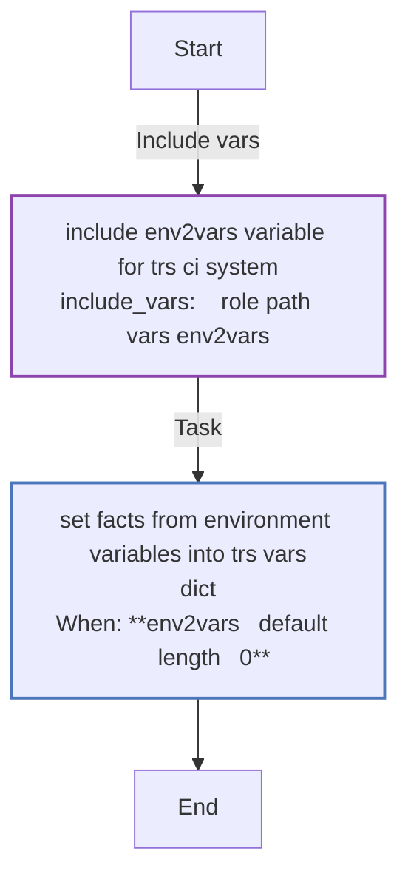


### Graph for ensure-file.yml

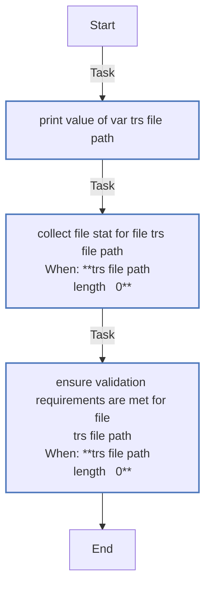


### Graph for ci-detect.yml

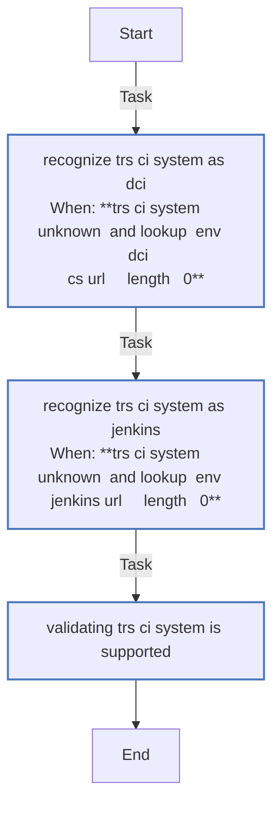


### Graph for metadata-detect.yml

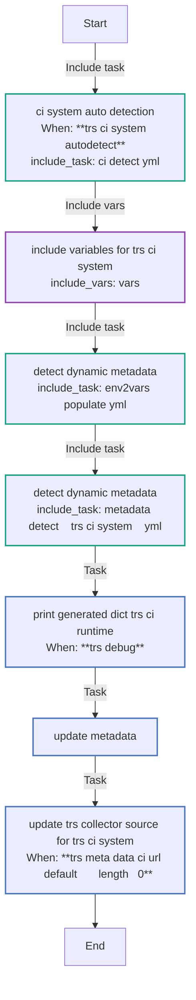


### Graph for dump-file.yml

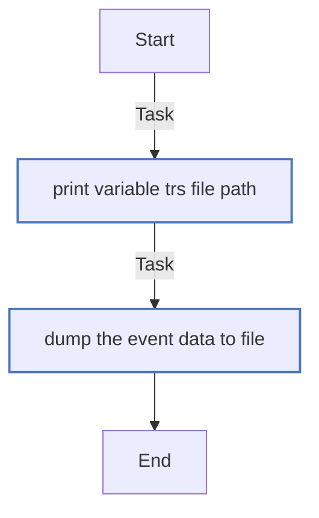


### Graph for main.yml

```mermaid
flowchart TD
Start
classDef block stroke:#3498db,stroke-width:2px;
classDef task stroke:#4b76bb,stroke-width:2px;
classDef includeTasks stroke:#16a085,stroke-width:2px;
classDef importTasks stroke:#34495e,stroke-width:2px;
classDef includeRole stroke:#2980b9,stroke-width:2px;
classDef importRole stroke:#699ba7,stroke-width:2px;
classDef includeVars stroke:#8e44ad,stroke-width:2px;
classDef rescue stroke:#665352,stroke-width:2px;

  Start-->|Task| Validate_all_required_variables_are_defined0[validate all required variables are defined]:::task
  Validate_all_required_variables_are_defined0-->|Include task| ensure_file_yml1[ensure presence and readability of essential input<br>files<br>When: **trs file path   length   0**<br>include_task: ensure file yml]:::includeTasks
  ensure_file_yml1-->|Task| Initialize_trs_meta_data2[initialize trs meta data]:::task
  Initialize_trs_meta_data2-->|Task| Read_content_of_JSON_file_trs_file_path3[read content of json file trs file path<br>When: **trs metadata path   length   0**]:::task
  Read_content_of_JSON_file_trs_file_path3-->|Task| Assign_JSON_content_into_trs_meta_data4[assign json content into trs meta data<br>When: **trs metadata path   length   0 and  trs metadata<br>path is defined and  trs metadata path content  <br>length   0**]:::task
  Assign_JSON_content_into_trs_meta_data4-->|Include task| metadata_detect_yml5[detect runtime metadata from our environment<br>include_task: metadata detect yml]:::includeTasks
  metadata_detect_yml5-->|Include task| reporting____trs_collector____yml6[send trs data event to collector trs collector<br>When: **trs report path   length   0**<br>include_task: reporting    trs collector    yml]:::includeTasks
  reporting____trs_collector____yml6-->End
```


### Graph for reporting/splunk.yml

```mermaid
flowchart TD
Start
classDef block stroke:#3498db,stroke-width:2px;
classDef task stroke:#4b76bb,stroke-width:2px;
classDef includeTasks stroke:#16a085,stroke-width:2px;
classDef importTasks stroke:#34495e,stroke-width:2px;
classDef includeRole stroke:#2980b9,stroke-width:2px;
classDef importRole stroke:#699ba7,stroke-width:2px;
classDef includeVars stroke:#8e44ad,stroke-width:2px;
classDef rescue stroke:#665352,stroke-width:2px;

  Start-->|Task| Read_content_from_test_report_JSON_file0[read content from test report json file]:::task
  Read_content_from_test_report_JSON_file0-->|Task| Decode_JSON_content_of_test_report_file1[decode json content of test report file<br>When: **trs json file content content   length   0**]:::task
  Decode_JSON_content_of_test_report_file1-->|Task| Print_currently_used_timestamp_trs_default_ts2[print currently used timestamp trs default ts]:::task
  Print_currently_used_timestamp_trs_default_ts2-->|Task| Setup_timestamps_broken_down_to_int_float_parts_for_trs_collector3[setup timestamps broken down to int float parts<br>for trs collector]:::task
  Setup_timestamps_broken_down_to_int_float_parts_for_trs_collector3-->|Task| Setup_timestamps_as_floats_for_reporting4[setup timestamps as floats for reporting]:::task
  Setup_timestamps_as_floats_for_reporting4-->|Task| Update_trs_collector_auth_headers_with_trs_collector_auth_token_from_the_user_for_trs_collector5[update trs collector auth headers with trs<br>collector auth token from the user for trs<br>collector<br>When: **trs collector auth token   length   0 and trs<br>collector**]:::task
  Update_trs_collector_auth_headers_with_trs_collector_auth_token_from_the_user_for_trs_collector5-->|Task| Update_trs_collector_auth_headers_with_trs_collector_target_from_the_user_for_trs_collector6[update trs collector auth headers with trs<br>collector target from the user for trs collector<br>When: **trs collector target   length   0**]:::task
  Update_trs_collector_auth_headers_with_trs_collector_target_from_the_user_for_trs_collector6-->|Task| Set_default_allowed_status_codes7[set default allowed status codes]:::task
  Set_default_allowed_status_codes7-->|Task| Set_allowed_status_codes8[set allowed status codes<br>When: **trs do send**]:::task
  Set_allowed_status_codes8-->|Include task| validations_yml9[validate splunk related data<br>include_task: validations yml]:::includeTasks
  validations_yml9-->|Task| Create_event_data_attributes10[create event data attributes]:::task
  Create_event_data_attributes10-->|Task| Print_event_data_before_timestamp_corrections11[print event data before timestamp corrections]:::task
  Print_event_data_before_timestamp_corrections11-->|Task| Combine_additional_attributes_into_the_data_at_trs_collector_target_for_trs_collector12[combine additional attributes into the data at trs<br>collector target for trs collector]:::task
  Combine_additional_attributes_into_the_data_at_trs_collector_target_for_trs_collector12-->|Include task| dump_file_yml13[print variable trs event dump file<br>When: **trs event dump file   length   0 and trs event<br>save**<br>include_task: dump file yml]:::includeTasks
  dump_file_yml13-->|Task| Send_data_to_trs_collector14[send data to trs collector<br>When: **trs do send   default false**]:::task
  Send_data_to_trs_collector14-->End
```


### Graph for reporting/validations.yml

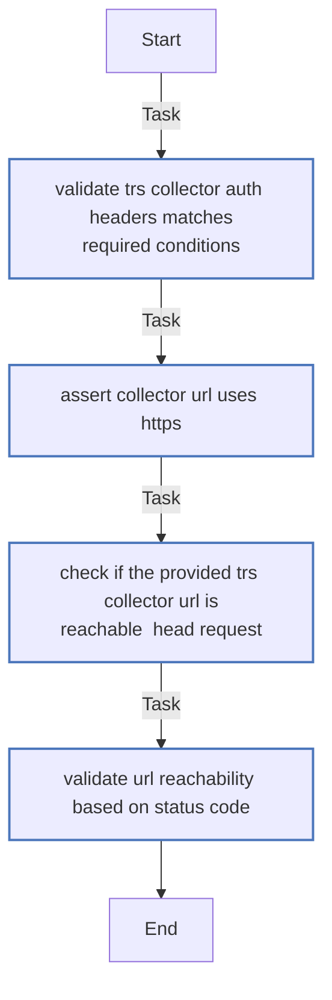


### Graph for metadata-detect/jenkins.yml

```mermaid
flowchart TD
Start
classDef block stroke:#3498db,stroke-width:2px;
classDef task stroke:#4b76bb,stroke-width:2px;
classDef includeTasks stroke:#16a085,stroke-width:2px;
classDef importTasks stroke:#34495e,stroke-width:2px;
classDef includeRole stroke:#2980b9,stroke-width:2px;
classDef importRole stroke:#699ba7,stroke-width:2px;
classDef includeVars stroke:#8e44ad,stroke-width:2px;
classDef rescue stroke:#665352,stroke-width:2px;

  Start-->|Task| Update_is_ci_in_trs_ci_runtime_attribute_for_trs_ci_system0[update is ci in trs ci runtime attribute for trs<br>ci system]:::task
  Update_is_ci_in_trs_ci_runtime_attribute_for_trs_ci_system0-->|Task| Update_helper_variables_for_ci_attributes_for_trs_ci_system1[update helper variables for ci attributes for trs<br>ci system]:::task
  Update_helper_variables_for_ci_attributes_for_trs_ci_system1-->|Task| Update_helper_variables_for_ci_attributes_for_trs_ci_system2[update helper variables for ci attributes for trs<br>ci system]:::task
  Update_helper_variables_for_ci_attributes_for_trs_ci_system2-->|Task| Update_helper_variables_for_ci_runner_attributes_for_trs_ci_system3[update helper variables for ci runner attributes<br>for trs ci system]:::task
  Update_helper_variables_for_ci_runner_attributes_for_trs_ci_system3-->|Task| Update_helper_variables_for_trs_ci_runtime_attributes_for_trs_ci_system4[update helper variables for trs ci runtime<br>attributes for trs ci system]:::task
  Update_helper_variables_for_trs_ci_runtime_attributes_for_trs_ci_system4-->|Task| Update_helper_variables_for_job_attributes_for_trs_ci_system5[update helper variables for job attributes for trs<br>ci system]:::task
  Update_helper_variables_for_job_attributes_for_trs_ci_system5-->|Task| Update_helper_variables_for_source_attributes_for_trs_ci_system6[update helper variables for source attributes for<br>trs ci system]:::task
  Update_helper_variables_for_source_attributes_for_trs_ci_system6-->|Task| Update_helper_variables_for_source_change_attributes_for_trs_ci_system7[update helper variables for source change<br>attributes for trs ci system]:::task
  Update_helper_variables_for_source_change_attributes_for_trs_ci_system7-->|Task| Update_helper_variables_for_source_attributes_for_trs_ci_system8[update helper variables for source attributes for<br>trs ci system]:::task
  Update_helper_variables_for_source_attributes_for_trs_ci_system8-->|Task| Construct_the_final_trs_ci_runtime_metadata_dictionary_for_trs_ci_system9[construct the final trs ci runtime metadata<br>dictionary for trs ci system]:::task
  Construct_the_final_trs_ci_runtime_metadata_dictionary_for_trs_ci_system9-->End
```


### Graph for metadata-detect/dci.yml

```mermaid
flowchart TD
Start
classDef block stroke:#3498db,stroke-width:2px;
classDef task stroke:#4b76bb,stroke-width:2px;
classDef includeTasks stroke:#16a085,stroke-width:2px;
classDef importTasks stroke:#34495e,stroke-width:2px;
classDef includeRole stroke:#2980b9,stroke-width:2px;
classDef importRole stroke:#699ba7,stroke-width:2px;
classDef includeVars stroke:#8e44ad,stroke-width:2px;
classDef rescue stroke:#665352,stroke-width:2px;

  Start-->|Task| Set_is_ci_attribute0[set is ci attribute<br>When: **lookup  env   ci     lower     true  and lookup <br>env   dci cs url   is defined**]:::task
  Set_is_ci_attribute0-->|Task| Update_trs_ci_runtime_type_for_trs_ci_system1[update trs ci runtime type for trs ci system]:::task
  Update_trs_ci_runtime_type_for_trs_ci_system1-->|Task| Update_trs_ci_runtime_url_for_trs_ci_system2[update trs ci runtime url for trs ci system]:::task
  Update_trs_ci_runtime_url_for_trs_ci_system2-->|Task| Print_trs_meta_data__Before_squash_of_metadata_key_3[print trs meta data  before squash of metadata key<br>]:::task
  Print_trs_meta_data__Before_squash_of_metadata_key_3-->|Task| Update_ci_in_metadata4[update ci in metadata]:::task
  Update_ci_in_metadata4-->|Task| Merge__metadata__into_root_trs_meta_data5[merge  metadata  into root trs meta data<br>When: **trs metadata path   length   0 and trs meta data  <br>length   0 and   metadata  in trs meta data keys  <br> and trs meta data metadata   length   0**]:::task
  Merge__metadata__into_root_trs_meta_data5-->|Task| Print_trs_meta_data__AFTER_squash_of_metadata_key_6[print trs meta data  after squash of metadata key ]:::task
  Print_trs_meta_data__AFTER_squash_of_metadata_key_6-->|Task| Delete_trs_meta_data_key__metadata_7[delete trs meta data key  metadata <br>When: **trs metadata path   length   0 and trs meta data  <br>length   0 and   metadata  in trs meta data keys  <br> and trs meta data metadata   length   0**]:::task
  Delete_trs_meta_data_key__metadata_7-->|Task| Print_trs_meta_data__AFTER_deleting_of_metadata_key_8[print trs meta data  after deleting of metadata<br>key ]:::task
  Print_trs_meta_data__AFTER_deleting_of_metadata_key_8-->End
```


### Graph for metadata-detect/unknown.yml

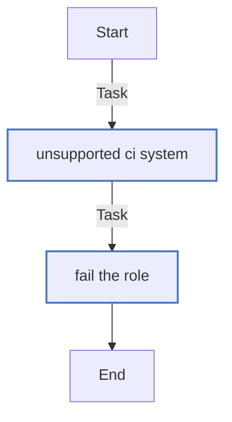


## Playbook

```yml
---
- name: Run test_report_send role
  hosts: localhost
  connection: local
  gather_facts: false
  roles:
    - role: redhatci.ocp.test_report_send

```
## Playbook graph
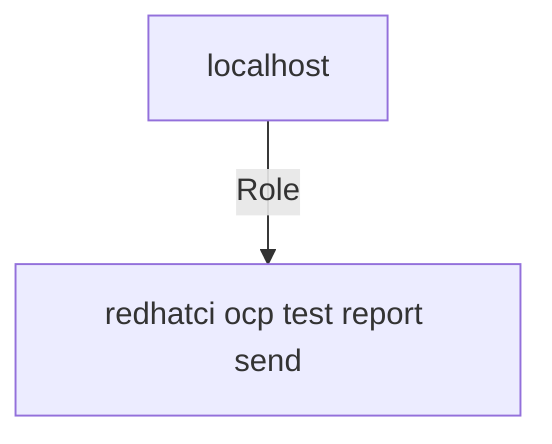

## Author Information
Max Kovgan, Cesare Placanica

#### License

Apache License, Version 2.0

#### Minimum Ansible Version

2.9

#### Platforms

No platforms specified.
<!-- DOCSIBLE END -->